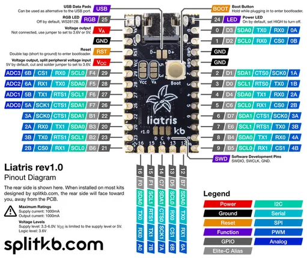

# Liatris

**SplitKB** · RP2040

Revision: Not identified  
Coverage: Pinout image collected

[Browse all manufacturers](../../../../BROWSE.md) · [Desktop app](https://github.com/valleytechsolutions/black-wire-desktop)

## Physical board pinout

**pinout image** · Reviewed source · JPG

[Open original reference](../../../../library/media/cc803c3af6bd5ccbff7804f0817d57d89ee2da51e1b745bc28053db28bda19fd.jpg)

**Credit and rights:** Not established; source attribution retained. Source/manufacturer: SplitKB.

[Source 1](https://splitkb.com/cdn/shop/files/Liatrisrev1.0PinoutDiagram_833x700.jpg?v=1716979720) · [Source 2](https://splitkb.com/products/liatris)

Discovered from CircuitPython board metadata and the linked product/documentation page. Exact hardware revision requires matching to the diagram.

SHA-256: `cc803c3af6bd5ccbff7804f0817d57d89ee2da51e1b745bc28053db28bda19fd`

Pin assignments have not been independently electrically verified. Check board revision before wiring.
