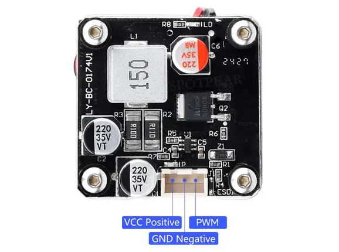

# Laser-450nm-5W driver

**Spotpear (manufacturer unconfirmed)** · Expansion

Revision: Not identified

Coverage: Partial pinout collected; full reference still needed

[Browse all manufacturers](../../../../BROWSE.md) · [Devices & IoT](../../../../DEVICES.md) · [Open in the browser guide](https://valleytech-black-wire-guide.pages.dev/?board=spotpear-manufacturer-unconfirmed-expansion-laser-450nm-5w-driver)

## Datasheets and original documentation

Board datasheet: **not yet recorded**. Visual reference: **available**.

Original manufacturer website still needs identification.

A chip datasheet, schematic and board datasheet have different scopes. Match the exact hardware revision.

[Documentation coverage and remaining gaps](../../../../DOCUMENTATION.md)

## Pinout - Spotpear source

**pinout image** · Reviewed source · JPG

[Open original reference](../../../../library/media/c81f409e5fb6e91cf353b23a81008dc5aec797093fb5faf6dc81ecd0bcc38cc5.jpg)

**Credit and rights:** Not established; source attribution retained. Source/manufacturer: Spotpear (manufacturer unconfirmed).

[Source 1](https://cdn.static.spotpear.com/uploads/picture/product/module/sensors/Laser-450nm-5W/Laser-450nm-5W-details-04-EN.jpg) · [Source 2](https://spotpear.com/shop/Laser-450nm-5W-high-precision-module-For-Laser-carving-3D-printing/Laser-450nm-5W.html)

Source image saved from Spotpear. Original manufacturer not independently established; seller attribution retained.

Image revision: Not identified

SHA-256: `c81f409e5fb6e91cf353b23a81008dc5aec797093fb5faf6dc81ecd0bcc38cc5`

Pin assignments have not been independently electrically verified. Check board revision before wiring.
