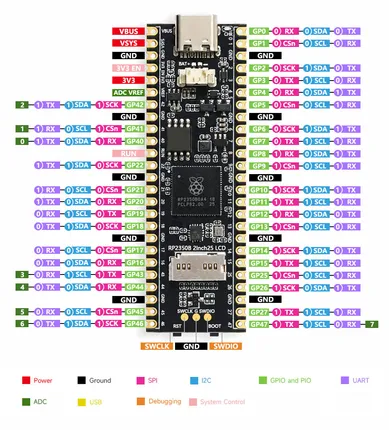

# RP2350B-LCD-2.25

**Spotpear (manufacturer unconfirmed)** · RP2350

Revision: Not identified  
Coverage: Pinout image collected

[Browse all manufacturers](../../../../BROWSE.md) · [Desktop app](https://github.com/valleytechsolutions/black-wire-desktop)

## Pinout - Spotpear source

**pinout image** · Reviewed source · JPG

[Open original reference](../../../../library/media/165a55689c84adaba9d1c6b07d7705044b789806dd7eebcab459563de8ead955.jpg)

**Credit and rights:** Not established; source attribution retained. Source/manufacturer: Spotpear (manufacturer unconfirmed).

[Source 1](https://cdn.static.spotpear.com/uploads/picture/product/raspberry-pi/rpi-pico-expansion/RP2350B-LCD-2.25/RP2350B-LCD-details-03.jpg) · [Source 2](https://spotpear.com/shop/Raspberry-Pi-Pico-2-RP2350B-2.25-inch-LCD-76x284-RGB-Lighting.html)

Source image saved from Spotpear. Original manufacturer not independently established; seller attribution retained. Black RP2350B Pico2 Pro display PCB shown; do not confuse with Raspberry Pi official Pico 2.

SHA-256: `165a55689c84adaba9d1c6b07d7705044b789806dd7eebcab459563de8ead955`

Pin assignments have not been independently electrically verified. Check board revision before wiring.
