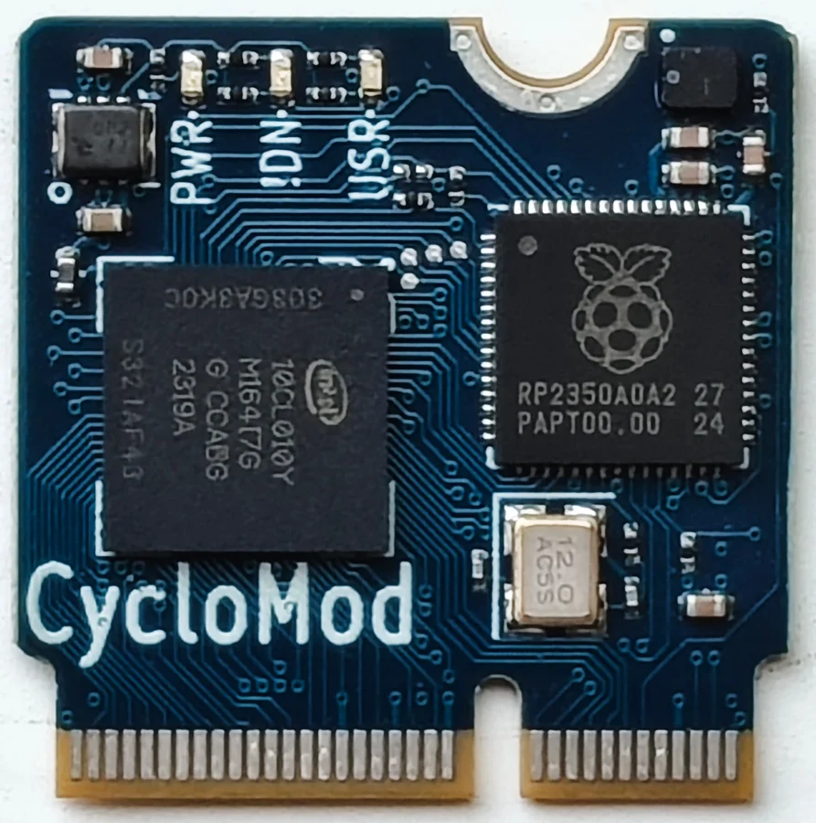
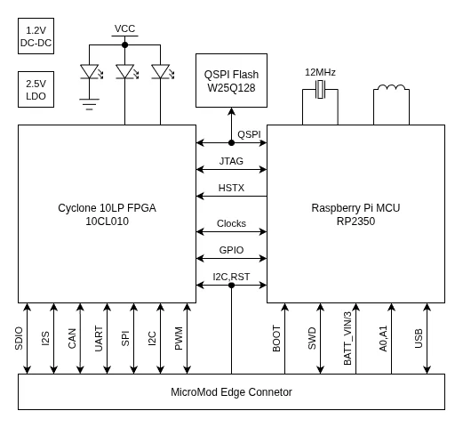

# CycloMod

**Steiert Solutions** · RP2350 / Cyclone 10 LP

Revision: Main repository checked 26 September 2026

Coverage: Supporting documentation; physical pinout still needed

[Browse all manufacturers](../../../../BROWSE.md) · [Devices & IoT](../../../../DEVICES.md) · [Open in the browser guide](https://valleytech-black-wire-guide.pages.dev/?board=steiert-solutions-cyclomod)

Architecture: **ARM / RISC-V**

## Datasheets and original documentation

Board datasheet: **not yet recorded**. Visual reference: **available**.

[Original manufacturer hardware documentation](https://github.com/gsteiert/cyclomod)

- **design-files / board**: [Creator hardware design repository](https://github.com/gsteiert/cyclomod) · online

Creator campaign is gathering interest. The published block diagram and board photograph are supporting references. A physical MicroMod pinout image and board datasheet still need collection; do not substitute a generic MicroMod pinout.

[Documentation coverage and remaining gaps](../../../../DOCUMENTATION.md)

## Specifications and hardware documentation

- [Manufacturer hardware documentation](https://github.com/gsteiert/cyclomod)

## CycloMod visual identification

**product photograph** · Reviewed source · JPG

[Open original reference](../../../../library/media/9a6d65297fa90750c874867ae341a2cd1af3f1a6572a28a09df5d03fe6edb74c.jpg)

**Credit and rights:** Steiert Solutions / original contributors. Asset-specific redistribution and print rights have not been established. Original artwork is not relicensed by Black Wire's editorial license.. Source/manufacturer: Steiert Solutions.

[Source 1](https://raw.githubusercontent.com/gsteiert/cyclomod/main/img/cyclomod-close.jpg) · [Source 2](https://github.com/gsteiert/cyclomod)

Source reviewed for model and reference type; pin assignments are not independently electrically validated.

Image revision: Main repository checked 26 September 2026

SHA-256: `9a6d65297fa90750c874867ae341a2cd1af3f1a6572a28a09df5d03fe6edb74c`

## FPGA, RP2350 and MicroMod interconnect block diagram

**GPIO block diagram** · Reviewed source · PNG

[Open original reference](../../../../library/media/c30ed5cf28e9be02bd527343f2ded46038f7258a1b9943f585d4f6250c0c063d.png)

**Credit and rights:** Steiert Solutions / original contributors. Asset-specific redistribution and print rights have not been established. Original artwork is not relicensed by Black Wire's editorial license.. Source/manufacturer: Steiert Solutions.

[Source 1](https://raw.githubusercontent.com/gsteiert/cyclomod/main/img/CycloMod-BD.png) · [Source 2](https://github.com/gsteiert/cyclomod)

Source reviewed for model and reference type; pin assignments are not independently electrically validated.

Image revision: Main repository checked 26 September 2026

SHA-256: `c30ed5cf28e9be02bd527343f2ded46038f7258a1b9943f585d4f6250c0c063d`

Pin assignments have not been independently electrically verified. Check board revision before wiring.
