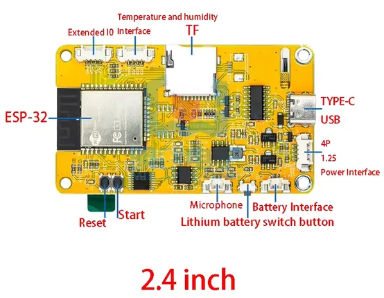

# ESP32-2432S024

**Sunton** · ESP32

Revision: Not identified  
Coverage: Board labels only; pinout needed

[Browse all manufacturers](../../../../BROWSE.md) · [Devices & IoT](../../../../DEVICES.md) · [Open in the browser guide](https://valleytech-black-wire-guide.pages.dev/?board=sunton-cyd-esp32-2432s024)

Device category: **Displays & HMI**

## Community board reference

**board labeling image** · Reviewed source · PNG

[Open original reference](../../../../library/media/6de33dfd97d9de83cb1760d78924554eeac796304bc9058c1b60b46e24eceb91.png)

**Credit and rights:** Not established; source attribution retained. Source/manufacturer: Sunton.

[Source 1](https://f1atb.fr/wp-content/uploads/2026/02/Capture-decran-2026-01-17-084538.png) · [Source 2](https://f1atb.fr/esp32-2432s028-esp32-2432s024-jc2432w328/)

Variant must be identified from this exact image and its surrounding source text.

Image revision: Not identified

SHA-256: `6de33dfd97d9de83cb1760d78924554eeac796304bc9058c1b60b46e24eceb91`

Pin assignments have not been independently electrically verified. Check board revision before wiring.
