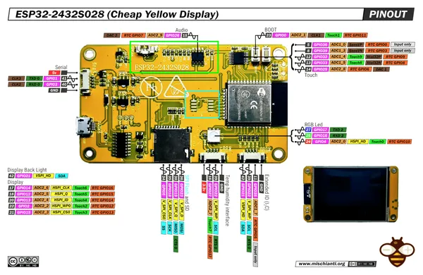

# ESP32-2432S028

**Sunton** · ESP32

Revision: Not identified  
Coverage: Pinout image collected

[Browse all manufacturers](../../../../BROWSE.md) · [Devices & IoT](../../../../DEVICES.md) · [Open in the browser guide](https://valleytech-black-wire-guide.pages.dev/?board=sunton-cyd-esp32-2432s028)

Device category: **Displays & HMI**

## Community pinout

**pinout image** · Reviewed source · PNG

[Open original reference](../../../../library/media/5cc01ba6a45d5e3e05ac7934eca49b8b39d567ebf5a027ac56b0cf73fbeb2e00.png)

**Credit and rights:** Not established; source attribution retained. Source/manufacturer: Sunton.

[Source 1](https://mischianti.org/wp-content/uploads/2025/04/ESP32-2432S028-ili9341-touch-Cheap-Yellow-Display-pinout-high.png) · [Source 2](https://mischianti.org/esp32-2432s028-cheap-yellow-display-high-resolution-pinout-datasheet-schema-and-specs/)

Board label ESP32-2432S028; ILI9341 model shown. Do not assume compatibility with USB-C/ST7789 revisions.

Image revision: Not identified

SHA-256: `5cc01ba6a45d5e3e05ac7934eca49b8b39d567ebf5a027ac56b0cf73fbeb2e00`

Pin assignments have not been independently electrically verified. Check board revision before wiring.
