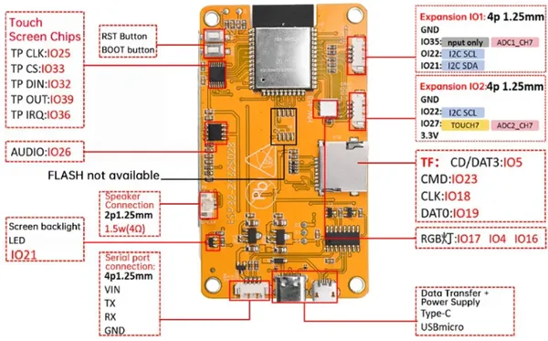
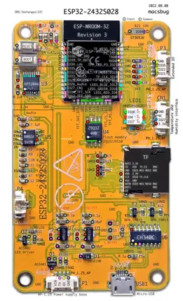
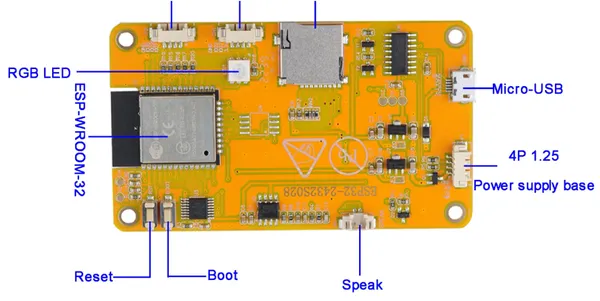

# ESP32-2432S028R

**Sunton** · ESP32

Revision: Multiple source/revision records; see individual assets  
Coverage: Pinout image collected

[Browse all manufacturers](../../../../BROWSE.md) · [Desktop app](https://github.com/valleytechsolutions/black-wire-desktop)

## Community board reference

**pinout image** · Reviewed source · PNG

[Open original reference](../../../../library/media/5e05a01c0b42b8d9d291411e3ead8a2cd85681caa71e4d06b22efa989fe7081b.png)

**Credit and rights:** Not established; source attribution retained. Source/manufacturer: Sunton.

[Source 1](https://f1atb.fr/wp-content/uploads/2025/01/Capture-decran-2025-01-10-084054.png) · [Source 2](https://f1atb.fr/esp32-2432s028-esp32-2432s024-jc2432w328/)

Variant must be identified from this exact image and its surrounding source text.

SHA-256: `5e05a01c0b42b8d9d291411e3ead8a2cd85681caa71e4d06b22efa989fe7081b`

## Annotated PCB pinout - original author

**pinout image** · Reviewed source · PNG

[Open original reference](../../../../library/media/c0158331fedcda6c125ae08e65caa275ba37f6960845d3095839dde6373566c0.png)

**Credit and rights:** Not established; source attribution retained. Source/manufacturer: Sunton.

[Source 1](https://macsbug.wordpress.com/wp-content/uploads/2022/08/esp32_2432s028_pcb.pdf) · [Source 2](https://macsbug.wordpress.com/2022/08/17/esp32-2432s028/)

Original annotated PCB photograph from macsbug. Use the model and connector layout pictured; do not generalize to other touch or PCB revisions.

SHA-256: `c0158331fedcda6c125ae08e65caa275ba37f6960845d3095839dde6373566c0`

## Annotated PCB pinout - original author

**pinout image** · Reviewed source · PNG

[Open original reference](../../../../library/media/aa7f07eb612c7264b7c51bc17a61a3ec085a2c30656ea4fc52d9237e7d7bcd60.png)

**Credit and rights:** Not established; source attribution retained. Source/manufacturer: Sunton.

[Source 1](https://macsbug.wordpress.com/wp-content/uploads/2022/08/esp32_2432s028_pcb-3.pdf) · [Source 2](https://macsbug.wordpress.com/2022/08/17/esp32-2432s028/)

Original annotated PCB photograph from macsbug. Use the model and connector layout pictured; do not generalize to other touch or PCB revisions.

SHA-256: `aa7f07eb612c7264b7c51bc17a61a3ec085a2c30656ea4fc52d9237e7d7bcd60`

## Board layout labels - PDF page 5

**board labeling image** · Reviewed source · PNG

[Open original reference](../../../../library/media/b6edae2270f6ecb5eb41e9acc8cd9cd94cb145d74151650e24728cf6b8287eeb.png)

**Credit and rights:** Not established; source attribution retained. Source/manufacturer: Sunton.

[Source 1](https://raw.githubusercontent.com/witnessmenow/ESP32-Cheap-Yellow-Display/0564a140c76de76ef34a8b7115044e7c6c852695/OriginalDocumentation/2-Specification/ESP32-2432S028%20Specifications-EN.pdf) · [Source 2](https://github.com/witnessmenow/ESP32-Cheap-Yellow-Display/blob/0564a140c76de76ef34a8b7115044e7c6c852695/OriginalDocumentation/2-Specification/ESP32-2432S028%20Specifications-EN.pdf)

 Original PDF page 5 rendered at 220 dpi; no labels changed. This labels board components/connectors and is not a pin-by-pin signal map.

SHA-256: `b6edae2270f6ecb5eb41e9acc8cd9cd94cb145d74151650e24728cf6b8287eeb`

## Community board reference

**board labeling image** · Reviewed source · PNG

[Open original reference](../../../../library/media/655a25e18c5e1cc554e621192e1dae2a1e588f6ca1aa4621a51db2a26e14ec8e.png)

**Credit and rights:** Not established; source attribution retained. Source/manufacturer: Sunton.

[Source 1](https://f1atb.fr/wp-content/uploads/2025/01/Capture-decran-2025-01-09-154629-1024x514.png) · [Source 2](https://f1atb.fr/esp32-2432s028-esp32-2432s024-jc2432w328/)

Variant must be identified from this exact image and its surrounding source text.

SHA-256: `655a25e18c5e1cc554e621192e1dae2a1e588f6ca1aa4621a51db2a26e14ec8e`

## Original manufacturer specification

**original reference PDF** · Reviewed source · PDF

[Open original reference](../../../../library/media/e3fb0ac1aadea6cf589c6bbe1a45d411879331d384e47c5361a471a6997911ab.pdf)

**Credit and rights:** Not established; source attribution retained. Source/manufacturer: Sunton.

[Source 1](https://raw.githubusercontent.com/witnessmenow/ESP32-Cheap-Yellow-Display/0564a140c76de76ef34a8b7115044e7c6c852695/OriginalDocumentation/2-Specification/ESP32-2432S028%20Specifications-EN.pdf) · [Source 2](https://github.com/witnessmenow/ESP32-Cheap-Yellow-Display/blob/0564a140c76de76ef34a8b7115044e7c6c852695/OriginalDocumentation/2-Specification/ESP32-2432S028%20Specifications-EN.pdf)

SHA-256: `e3fb0ac1aadea6cf589c6bbe1a45d411879331d384e47c5361a471a6997911ab`

## Community board reference

**original reference PDF** · Reviewed source · PDF

[Open original reference](../../../../library/media/8186990517bd704229e771c52fb05e4e35276f2df2d92f61750f8c5e59c95524.pdf)

**Credit and rights:** Not established; source attribution retained. Source/manufacturer: Sunton.

[Source 1](https://macsbug.wordpress.com/wp-content/uploads/2022/08/esp32_2432s028_pcb.pdf) · [Source 2](https://macsbug.wordpress.com/2022/08/17/esp32-2432s028/)

Variant must be identified from this exact image and its surrounding source text.

SHA-256: `8186990517bd704229e771c52fb05e4e35276f2df2d92f61750f8c5e59c95524`

## Community board reference

**original reference PDF** · Reviewed source · PDF

[Open original reference](../../../../library/media/e1fc8f70202ae02654a1c4728b937d513991435447b2172c43c3d487a58979ea.pdf)

**Credit and rights:** Not established; source attribution retained. Source/manufacturer: Sunton.

[Source 1](https://macsbug.wordpress.com/wp-content/uploads/2022/08/esp32_2432s028_pcb-3.pdf) · [Source 2](https://macsbug.wordpress.com/2022/08/17/esp32-2432s028/)

Variant must be identified from this exact image and its surrounding source text.

SHA-256: `e1fc8f70202ae02654a1c4728b937d513991435447b2172c43c3d487a58979ea`

Pin assignments have not been independently electrically verified. Check board revision before wiring.
