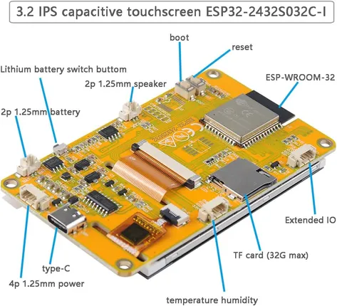

# ESP32-2432S032C-I

**Sunton** · ESP32

Revision: Not identified

Coverage: Board labels only; pinout needed

[Browse all manufacturers](../../../../BROWSE.md) · [Devices & IoT](../../../../DEVICES.md) · [Open in the browser guide](https://valleytech-black-wire-guide.pages.dev/?board=sunton-cyd-esp32-2432s032c-i)

Device category: **Displays & HMI**

## Datasheets and original documentation

Board datasheet: **not yet recorded**. Visual reference: **available**.

Original manufacturer website still needs identification.

A chip datasheet, schematic and board datasheet have different scopes. Match the exact hardware revision.

[Documentation coverage and remaining gaps](../../../../DOCUMENTATION.md)

## Community board reference

**board labeling image** · Reviewed source · JPG

[Open original reference](../../../../library/media/702b98e18ba234e37ce472df1e772fb898fb806cc598e33ac62bdb7524468559.jpg)

**Credit and rights:** Not established; source attribution retained. Source/manufacturer: Sunton.

[Source 1](https://f1atb.fr/wp-content/uploads/2026/03/ESP32-2432S032.jpg) · [Source 2](https://f1atb.fr/esp32-2432s028-esp32-2432s024-jc2432w328/)

Variant must be identified from this exact image and its surrounding source text.

Image revision: Not identified

SHA-256: `702b98e18ba234e37ce472df1e772fb898fb806cc598e33ac62bdb7524468559`

Pin assignments have not been independently electrically verified. Check board revision before wiring.
