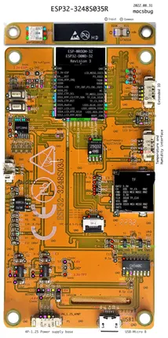

# ESP32-3248S035R

**Sunton** · ESP32

Revision: Not identified  
Coverage: Pinout image collected

[Browse all manufacturers](../../../../BROWSE.md) · [Devices & IoT](../../../../DEVICES.md) · [Open in the browser guide](https://valleytech-black-wire-guide.pages.dev/?board=sunton-cyd-esp32-3248s035r)

Device category: **Displays & HMI**

## Annotated PCB pinout - original author

**pinout image** · Reviewed source · PNG

[Open original reference](../../../../library/media/463ec925993ba82be8dab641297396cb8d3df1c11f8f3d1ec9baf15d8efd058f.png)

**Credit and rights:** Not established; source attribution retained. Source/manufacturer: Sunton.

[Source 1](https://macsbug.wordpress.com/wp-content/uploads/2022/09/esp32-3248s035r_pcb_layout-5.pdf) · [Source 2](https://macsbug.wordpress.com/2022/10/02/esp32-3248s035/)

Original annotated PCB photograph from macsbug. Use the model and connector layout pictured; do not generalize to other touch or PCB revisions.

Image revision: Not identified

SHA-256: `463ec925993ba82be8dab641297396cb8d3df1c11f8f3d1ec9baf15d8efd058f`

## Community board reference

**original reference PDF** · Reviewed source · PDF

[Open original reference](../../../../library/media/39b0fdfb05c21dc8436b3aae373cae3abac765b212216b4295d6e2ab37cc5a60.pdf)

**Credit and rights:** Not established; source attribution retained. Source/manufacturer: Sunton.

[Source 1](https://macsbug.wordpress.com/wp-content/uploads/2022/09/esp32-3248s035r_pcb_layout-5.pdf) · [Source 2](https://macsbug.wordpress.com/2022/10/02/esp32-3248s035/)

Variant must be identified from this exact image and its surrounding source text.

Image revision: Not identified

SHA-256: `39b0fdfb05c21dc8436b3aae373cae3abac765b212216b4295d6e2ab37cc5a60`

Pin assignments have not been independently electrically verified. Check board revision before wiring.
