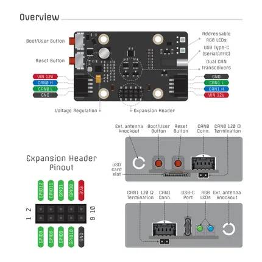
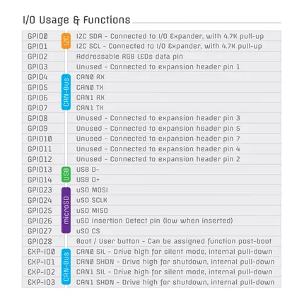

# CANipulator V2

**TechOverflow** · ESP32-C5

Revision: Not identified  
Coverage: Pinout image collected

[Browse all manufacturers](../../../../BROWSE.md) · [Devices & IoT](../../../../DEVICES.md) · [Open in the browser guide](https://valleytech-black-wire-guide.pages.dev/?board=techoverflow-gpio-device-canipulator-v2)

Device category: **Controllers & instruments**

## Board and connector pinout reference

**pinout image** · Reviewed source · PNG

[Open original reference](../../../../library/media/bc3f7569a325ef6f193da1bd2d937758b0531350264fc6b1afdc9949e76d0a1b.png)

**Credit and rights:** Not established; source attribution retained. Source/manufacturer: TechOverflow.

[Source 1](https://raw.githubusercontent.com/TechOverflow/CANipulator-docs/5b61678bf7b252f623078e9c7c68476ead8c942e/canipulator-v2.pdf) · [Source 2](https://github.com/TechOverflow/CANipulator-docs)

Image revision: Not identified

SHA-256: `bc3f7569a325ef6f193da1bd2d937758b0531350264fc6b1afdc9949e76d0a1b`

## GPIO function reference

**pinout image** · Reviewed source · PNG

[Open original reference](../../../../library/media/177954c7f7e87f5e6946df24e2e4d1e09a305dbb34353187e9b507270badfca6.png)

**Credit and rights:** Not established; source attribution retained. Source/manufacturer: TechOverflow.

[Source 1](https://raw.githubusercontent.com/TechOverflow/CANipulator-docs/5b61678bf7b252f623078e9c7c68476ead8c942e/canipulator-v2.pdf) · [Source 2](https://github.com/TechOverflow/CANipulator-docs)

Image revision: Not identified

SHA-256: `177954c7f7e87f5e6946df24e2e4d1e09a305dbb34353187e9b507270badfca6`

## Board pinout

**original reference PDF** · Reviewed source · PDF

[Open original reference](../../../../library/media/3dd1151af957a153575bea214e50ff14578d7c38d9c65ed2cb69cff3a1dedfe7.pdf)

**Credit and rights:** Not established; source attribution retained. Source/manufacturer: TechOverflow.

[Source 1](https://raw.githubusercontent.com/TechOverflow/CANipulator-docs/5b61678bf7b252f623078e9c7c68476ead8c942e/canipulator-v2.pdf) · [Source 2](https://github.com/TechOverflow/CANipulator-docs)

Image revision: Not identified

SHA-256: `3dd1151af957a153575bea214e50ff14578d7c38d9c65ed2cb69cff3a1dedfe7`

Pin assignments have not been independently electrically verified. Check board revision before wiring.
