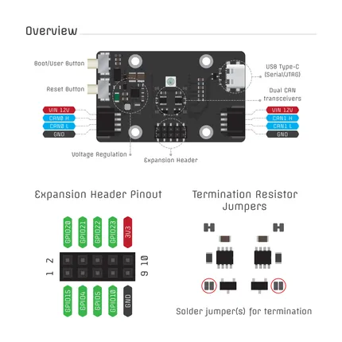
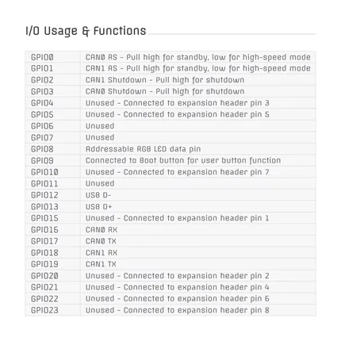

# CANipulator V1

**TechOverflow** · ESP32-C6

Revision: Not identified  
Coverage: Pinout image collected

[Browse all manufacturers](../../../../BROWSE.md) · [Devices & IoT](../../../../DEVICES.md) · [Open in the browser guide](https://valleytech-black-wire-guide.pages.dev/?board=techoverflow-gpio-device-canipulator-v1)

Device category: **Controllers & instruments**

## Board and connector pinout reference

**pinout image** · Reviewed source · PNG

[Open original reference](../../../../library/media/c9c6ce25a2b64a9d0d32495f8c5c90b70c7f23afe72e46eebbe6ac3ecdfe3c0b.png)

**Credit and rights:** Not established; source attribution retained. Source/manufacturer: TechOverflow.

[Source 1](https://raw.githubusercontent.com/TechOverflow/CANipulator-docs/5b61678bf7b252f623078e9c7c68476ead8c942e/canipulator.pdf) · [Source 2](https://github.com/TechOverflow/CANipulator-docs)

Image revision: Not identified

SHA-256: `c9c6ce25a2b64a9d0d32495f8c5c90b70c7f23afe72e46eebbe6ac3ecdfe3c0b`

## GPIO function reference

**pinout image** · Reviewed source · PNG

[Open original reference](../../../../library/media/c2ae3ab0ec9bc33d6f6e06f8416e86abf8347df39cfc4721cbd7ffc30a9e3174.png)

**Credit and rights:** Not established; source attribution retained. Source/manufacturer: TechOverflow.

[Source 1](https://raw.githubusercontent.com/TechOverflow/CANipulator-docs/5b61678bf7b252f623078e9c7c68476ead8c942e/canipulator.pdf) · [Source 2](https://github.com/TechOverflow/CANipulator-docs)

Image revision: Not identified

SHA-256: `c2ae3ab0ec9bc33d6f6e06f8416e86abf8347df39cfc4721cbd7ffc30a9e3174`

## Board pinout

**original reference PDF** · Reviewed source · PDF

[Open original reference](../../../../library/media/8aee9c9fc60fc72abc365b356ab085171451c5a641e080db85841f8ad59b0b31.pdf)

**Credit and rights:** Not established; source attribution retained. Source/manufacturer: TechOverflow.

[Source 1](https://raw.githubusercontent.com/TechOverflow/CANipulator-docs/5b61678bf7b252f623078e9c7c68476ead8c942e/canipulator.pdf) · [Source 2](https://github.com/TechOverflow/CANipulator-docs)

Image revision: Not identified

SHA-256: `8aee9c9fc60fc72abc365b356ab085171451c5a641e080db85841f8ad59b0b31`

Pin assignments have not been independently electrically verified. Check board revision before wiring.
