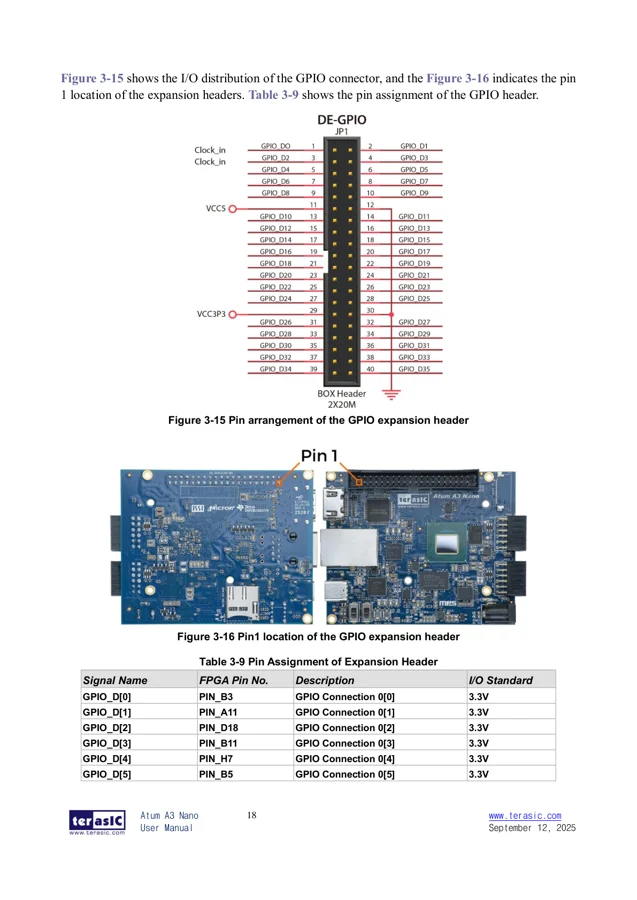

# Atum A3 Nano

**Terasic** · Agilex 3 FPGA

Revision: User manual 12 September 2025

Coverage: Physical pinout source collected; match revision and connector scope

[Browse all manufacturers](../../../../BROWSE.md) · [Devices & IoT](../../../../DEVICES.md) · [Open in the browser guide](https://valleytech-black-wire-guide.pages.dev/?board=terasic-atum-a3-nano)

Architecture: **FPGA**

## Datasheets and original documentation

Board datasheet: **not yet recorded**. Visual reference: **available**.

[Original manufacturer hardware documentation](https://www.crowdsupply.com/terasic/atum-a3-nano)

- **hardware-guide / board**: [Atum A3 Nano user manual — 12 September 2025](https://www.terasic.com.tw/cgi-bin/page/archive_download.pl?Language=English&No=1373&FID=a76cbdf7928c0c1125744cb16c312f97) · [saved document](../../../../library/media/8d7a8c3deff14b13fcb2e15e63be27eb7e8209a7aa95082ab25f540d7853aeaa.pdf)

JP1 40-pin GPIO connector and pin-1 location are shown in the manufacturer manual. The GPIO_D signal names are board nets; the separate FPGA package-pin table is not a substitute for the physical header map.

[Documentation coverage and remaining gaps](../../../../DOCUMENTATION.md)

## Specifications and hardware documentation

- [Manufacturer hardware documentation](https://www.crowdsupply.com/terasic/atum-a3-nano)

## Atum A3 Nano user manual — 12 September 2025

**original reference PDF** · Reviewed source · PDF

[Open original reference](../../../../library/media/8d7a8c3deff14b13fcb2e15e63be27eb7e8209a7aa95082ab25f540d7853aeaa.pdf)

**Credit and rights:** Terasic / original contributors. Asset-specific redistribution and print rights have not been established. Original artwork is not relicensed by Black Wire's editorial license.. Source/manufacturer: Terasic.

[Source 1](https://www.terasic.com.tw/cgi-bin/page/archive_download.pl?Language=English&No=1373&FID=a76cbdf7928c0c1125744cb16c312f97) · [Source 2](https://www.crowdsupply.com/terasic/atum-a3-nano)

Source reviewed for model and reference type; pin assignments are not independently electrically validated.

Image revision: User manual 12 September 2025

SHA-256: `8d7a8c3deff14b13fcb2e15e63be27eb7e8209a7aa95082ab25f540d7853aeaa`

## JP1 40-pin header and board orientation — manual page 18 (PDF page 19)

**pinout image** · Reviewed source · PNG

[Open original reference](../../../../library/media/aee3ad75d1979d4c10cedec17c38f20b5c4bde8d9592ea9ff4042496f59601ab.png)

**Credit and rights:** Terasic / original contributors. Asset-specific redistribution and print rights have not been established. Original artwork is not relicensed by Black Wire's editorial license.. Source/manufacturer: Terasic.

[Source 1](https://www.terasic.com.tw/cgi-bin/page/archive_download.pl?Language=English&No=1373&FID=a76cbdf7928c0c1125744cb16c312f97) · [Source 2](https://www.crowdsupply.com/terasic/atum-a3-nano)

Partial board coverage: JP1 only. Refer to the full manual for the two TMD GPIO connectors, I/O standards and electrical limits. Manufacturer PDF page rendered at 144 dpi; source PDF retained unchanged.

Image revision: User manual 12 September 2025

SHA-256: `aee3ad75d1979d4c10cedec17c38f20b5c4bde8d9592ea9ff4042496f59601ab`

Pin assignments have not been independently electrically verified. Check board revision before wiring.
