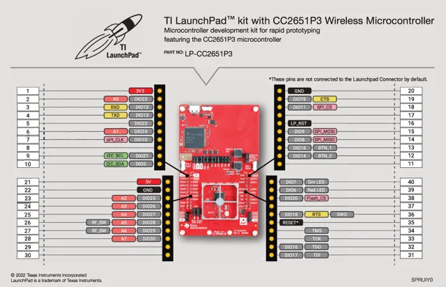

# LP-CC2651P3 LaunchPad

**Texas Instruments** · CC2651P3

Revision: Not identified

Coverage: Physical pinout reference; independent completeness review pending

[Browse all manufacturers](../../../../BROWSE.md) · [Devices & IoT](../../../../DEVICES.md) · [Open in the browser guide](https://valleytech-black-wire-guide.pages.dev/?board=ti-lp-cc2651p3)

Architecture: **ARM**

## Datasheets and original documentation

Board datasheet: **not yet recorded**. Visual reference: **available**.

[Original manufacturer product documentation](https://www.ti.com/tool/LP-CC2651P3)

- **hardware-guide / board**: [Manufacturer hardware guide / connector reference](https://www.ti.com/lit/pdf/SPRUIY0) · [saved document](../../../../library/media/e8193fea4f6c7e4d23dc8ce419d4ee488310e506c46bc017fa325e3e4ef53ca9.pdf)

Original source reviewed for model and visual type. Pin assignments and electrical limits have not been independently verified. Match the PCB revision before wiring.

[Documentation coverage and remaining gaps](../../../../DOCUMENTATION.md)

## Specifications and hardware documentation

- [Original model specifications](https://www.ti.com/tool/LP-CC2651P3)

## Original manufacturer hardware guide

**original reference PDF** · Reviewed source · PDF

[Open original reference](../../../../library/media/e8193fea4f6c7e4d23dc8ce419d4ee488310e506c46bc017fa325e3e4ef53ca9.pdf)

**Credit and rights:** Texas Instruments / original artwork contributors. Asset-specific redistribution and print rights are not established. Black Wire's editorial license does not relicense this artwork.. Source/manufacturer: Texas Instruments.

[Source 1](https://www.ti.com/lit/pdf/SPRUIY0) · [Source 2](https://www.ti.com/tool/LP-CC2651P3)

Original source reviewed for model and visual type. Pin assignments and electrical limits have not been independently verified. Match the PCB revision before wiring.

Image revision: Not identified

SHA-256: `e8193fea4f6c7e4d23dc8ce419d4ee488310e506c46bc017fa325e3e4ef53ca9`

## Manufacturer GPIO / connector reference — page 2

**pinout image** · Reviewed source · PNG

[Open original reference](../../../../library/media/729bd58fb3436523a2a49feb51f3080f53fcb7668164b38c87882bc8853e851e.png)

**Credit and rights:** Texas Instruments / original artwork contributors. Asset-specific redistribution and print rights are not established. Black Wire's editorial license does not relicense this artwork.. Source/manufacturer: Texas Instruments.

[Source 1](https://www.ti.com/lit/pdf/SPRUIY0) · [Source 2](https://www.ti.com/tool/LP-CC2651P3)

Original source reviewed for model and visual type. Pin assignments and electrical limits have not been independently verified. Match the PCB revision before wiring.

Image revision: Not identified

SHA-256: `729bd58fb3436523a2a49feb51f3080f53fcb7668164b38c87882bc8853e851e`

Pin assignments have not been independently electrically verified. Check board revision before wiring.
