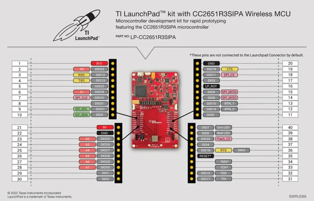

# LP-CC2651R3SIPA LaunchPad

**Texas Instruments** · CC2651R3SIPA

Revision: Not identified

Coverage: Physical pinout reference; independent completeness review pending

[Browse all manufacturers](../../../../BROWSE.md) · [Devices & IoT](../../../../DEVICES.md) · [Open in the browser guide](https://valleytech-black-wire-guide.pages.dev/?board=ti-lp-cc2651r3sipa)

Architecture: **ARM**

## Datasheets and original documentation

Board datasheet: **not yet recorded**. Visual reference: **available**.

[Original manufacturer product documentation](https://www.ti.com/tool/LP-CC2651R3SIPA)

- **hardware-guide / board**: [Manufacturer hardware guide / connector reference](https://www.ti.com/lit/pdf/SWRU589) · [saved document](../../../../library/media/3d30b1c201fedfe067936f2316605bdbf38ce0b0ba453947a7e48dc98f819747.pdf)

Original source reviewed for model and visual type. Pin assignments and electrical limits have not been independently verified. Match the PCB revision before wiring.

[Documentation coverage and remaining gaps](../../../../DOCUMENTATION.md)

## Specifications and hardware documentation

- [Original model specifications](https://www.ti.com/tool/LP-CC2651R3SIPA)

## Original manufacturer hardware guide

**original reference PDF** · Reviewed source · PDF

[Open original reference](../../../../library/media/3d30b1c201fedfe067936f2316605bdbf38ce0b0ba453947a7e48dc98f819747.pdf)

**Credit and rights:** Texas Instruments / original artwork contributors. Asset-specific redistribution and print rights are not established. Black Wire's editorial license does not relicense this artwork.. Source/manufacturer: Texas Instruments.

[Source 1](https://www.ti.com/lit/pdf/SWRU589) · [Source 2](https://www.ti.com/tool/LP-CC2651R3SIPA)

Original source reviewed for model and visual type. Pin assignments and electrical limits have not been independently verified. Match the PCB revision before wiring.

Image revision: Not identified

SHA-256: `3d30b1c201fedfe067936f2316605bdbf38ce0b0ba453947a7e48dc98f819747`

## Manufacturer GPIO / connector reference — page 2

**pinout image** · Reviewed source · PNG

[Open original reference](../../../../library/media/0fce166e1b274a44c54a54c47c640677b37f607239bc0ea7a948c4fbd3fb5304.png)

**Credit and rights:** Texas Instruments / original artwork contributors. Asset-specific redistribution and print rights are not established. Black Wire's editorial license does not relicense this artwork.. Source/manufacturer: Texas Instruments.

[Source 1](https://www.ti.com/lit/pdf/SWRU589) · [Source 2](https://www.ti.com/tool/LP-CC2651R3SIPA)

Original source reviewed for model and visual type. Pin assignments and electrical limits have not been independently verified. Match the PCB revision before wiring.

Image revision: Not identified

SHA-256: `0fce166e1b274a44c54a54c47c640677b37f607239bc0ea7a948c4fbd3fb5304`

Pin assignments have not been independently electrically verified. Check board revision before wiring.
