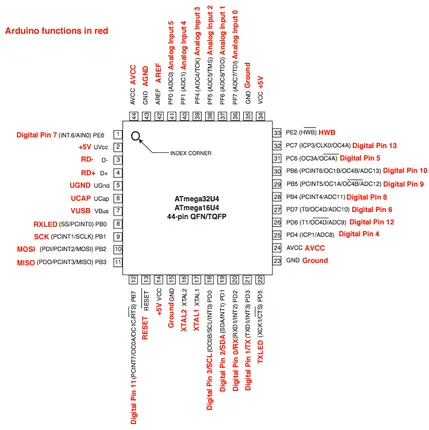
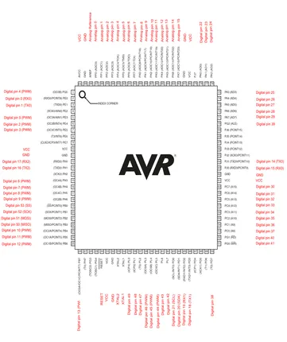
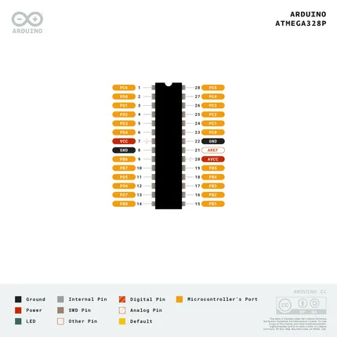

# ATmega

**Unattributed chip reference** · Chip reference

Revision: Unverified source identity

Coverage: Source collection; review pending

[Browse all manufacturers](../../../../BROWSE.md) · [Devices & IoT](../../../../DEVICES.md) · [Open in the browser guide](https://valleytech-black-wire-guide.pages.dev/?board=source-board-58c935f3ada73fde17)

## Datasheets and original documentation

Board datasheet: **not yet recorded**. Visual reference: **still needed**.

Original manufacturer website still needs identification.

A chip datasheet, schematic and board datasheet have different scopes. Match the exact hardware revision.

[Documentation coverage and remaining gaps](../../../../DOCUMENTATION.md)

## Unreviewed reference

**chip-package reference** · Unreviewed source · PNG

[Open original reference](../../../../library/media/7d2a36f0940196ecd5b5418753f2465d039c8c88f2cb0956dcc3dcc8d337fba3.png)

**Credit and rights:** Source rights not yet established. Source/manufacturer: Unattributed chip reference.

Original source index: Unreviewed reference. This file is searchable but has not been promoted to a reviewed physical board pinout.

Image revision: Not identified

SHA-256: `7d2a36f0940196ecd5b5418753f2465d039c8c88f2cb0956dcc3dcc8d337fba3`

## Unreviewed reference

**chip-package reference** · Unreviewed source · PNG

[Open original reference](../../../../library/media/68efd7e7096eedb3e64e55da757686685ce35a97cf6ff8cd40d016fe352ae0d8.png)

**Credit and rights:** Source rights not yet established. Source/manufacturer: Unattributed chip reference.

Original source index: Unreviewed reference. This file is searchable but has not been promoted to a reviewed physical board pinout.

Image revision: Not identified

SHA-256: `68efd7e7096eedb3e64e55da757686685ce35a97cf6ff8cd40d016fe352ae0d8`

## Unreviewed reference

**chip-package reference** · Unreviewed source · PNG

[Open original reference](../../../../library/media/e5a2068f36df4f0262d579f906ef46b79f9bccd0a92486fa19b28fab5b443ceb.png)

**Credit and rights:** Source rights not yet established. Source/manufacturer: Unattributed chip reference.

Original source index: Unreviewed reference. This file is searchable but has not been promoted to a reviewed physical board pinout.

Image revision: Not identified

SHA-256: `e5a2068f36df4f0262d579f906ef46b79f9bccd0a92486fa19b28fab5b443ceb`

Pin assignments have not been independently electrically verified. Check board revision before wiring.
