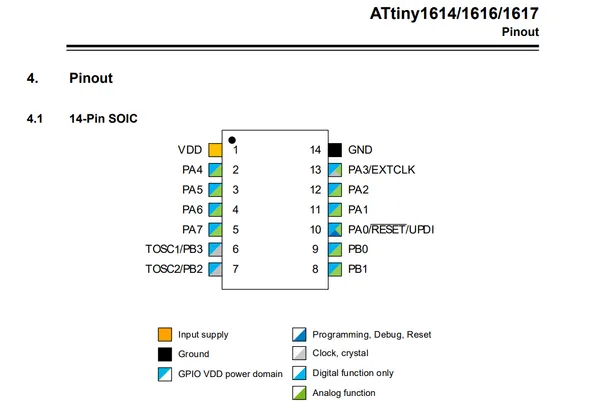
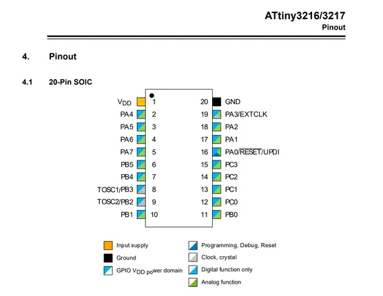
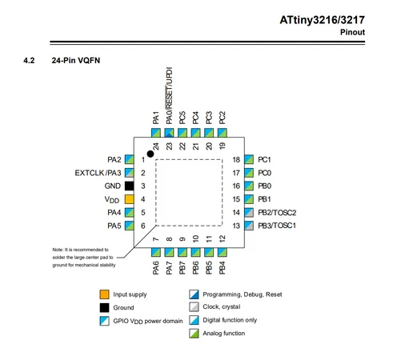
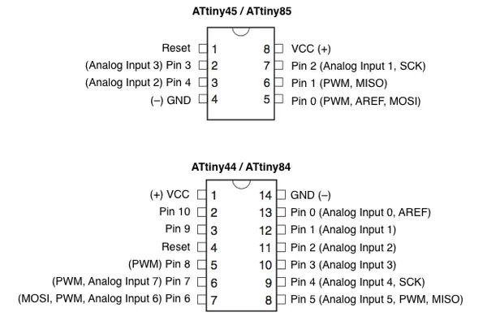

# ATtiny

**Unattributed chip reference** · Chip reference

Revision: Unverified source identity

Coverage: Source collection; review pending

[Browse all manufacturers](../../../../BROWSE.md) · [Devices & IoT](../../../../DEVICES.md) · [Open in the browser guide](https://valleytech-black-wire-guide.pages.dev/?board=source-board-0bb50be3f1eb6412d9)

## Datasheets and original documentation

Board datasheet: **not yet recorded**. Visual reference: **still needed**.

Original manufacturer website still needs identification.

A chip datasheet, schematic and board datasheet have different scopes. Match the exact hardware revision.

[Documentation coverage and remaining gaps](../../../../DOCUMENTATION.md)

## Unreviewed reference

**chip-package reference** · Unreviewed source · PNG

[Open original reference](../../../../library/media/77abe01859c22ca30a183fc84d308176907f770e175e5c169e1eb5fc6fc12177.png)

**Credit and rights:** Source rights not yet established. Source/manufacturer: Unattributed chip reference.

Original source index: Unreviewed reference. This file is searchable but has not been promoted to a reviewed physical board pinout.

Image revision: Not identified

SHA-256: `77abe01859c22ca30a183fc84d308176907f770e175e5c169e1eb5fc6fc12177`

## Unreviewed reference

**chip-package reference** · Unreviewed source · PNG

[Open original reference](../../../../library/media/1a8cb01b148a10bca4a28e3a4d05d65bd7a49eb0f739d189e07ef01917e82de8.png)

**Credit and rights:** Source rights not yet established. Source/manufacturer: Unattributed chip reference.

Original source index: Unreviewed reference. This file is searchable but has not been promoted to a reviewed physical board pinout.

Image revision: Not identified

SHA-256: `1a8cb01b148a10bca4a28e3a4d05d65bd7a49eb0f739d189e07ef01917e82de8`

## Unreviewed reference

**chip-package reference** · Unreviewed source · PNG

[Open original reference](../../../../library/media/0d6f5403dd92d47579355c6168d92d70624bef47242b0d50163e40a266a16453.png)

**Credit and rights:** Source rights not yet established. Source/manufacturer: Unattributed chip reference.

Original source index: Unreviewed reference. This file is searchable but has not been promoted to a reviewed physical board pinout.

Image revision: Not identified

SHA-256: `0d6f5403dd92d47579355c6168d92d70624bef47242b0d50163e40a266a16453`

## Unreviewed reference

**chip-package reference** · Unreviewed source · PNG

[Open original reference](../../../../library/media/cfee3a612d4b61fc4f69c0af9bdf3f936c138c9f3b1a23efc670aea2e28e43ed.png)

**Credit and rights:** Source rights not yet established. Source/manufacturer: Unattributed chip reference.

Original source index: Unreviewed reference. This file is searchable but has not been promoted to a reviewed physical board pinout.

Image revision: Not identified

SHA-256: `cfee3a612d4b61fc4f69c0af9bdf3f936c138c9f3b1a23efc670aea2e28e43ed`

Pin assignments have not been independently electrically verified. Check board revision before wiring.
