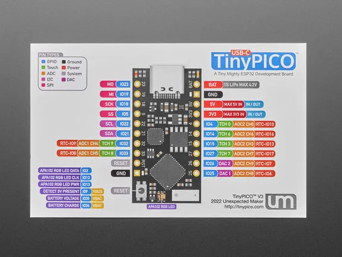

# Unexpected Maker TinyPICO

**Unexpected Maker** · ESP32 original

Revision: Not identified  
Coverage: Pinout image collected

[Browse all manufacturers](../../../../BROWSE.md) · [Desktop app](https://github.com/valleytechsolutions/black-wire-desktop)

## Physical board pinout

**pinout image** · Reviewed source · JPG

[Open original reference](../../../../library/media/03618bb6a5efacbfef5f823139041ec9c3a844e48f39d557e11254dcad39366b.jpg)

**Credit and rights:** Not established; source attribution retained. Source/manufacturer: Unexpected Maker.

[Source 1](https://cdn-shop.adafruit.com/1200x900/5028-07.jpg) · [Source 2](https://www.adafruit.com/product/5028)

Discovered from CircuitPython board metadata and the linked product/documentation page. Exact hardware revision requires matching to the diagram.

SHA-256: `03618bb6a5efacbfef5f823139041ec9c3a844e48f39d557e11254dcad39366b`

Pin assignments have not been independently electrically verified. Check board revision before wiring.
