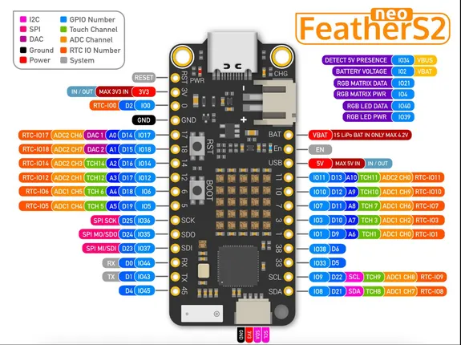

# Unexpected Maker FeatherS2 Neo

**Unexpected Maker** · ESP32-S2

Revision: Not identified  
Coverage: Pinout image collected

[Browse all manufacturers](../../../../BROWSE.md) · [Desktop app](https://github.com/valleytechsolutions/black-wire-desktop)

## Physical board pinout

**pinout image** · Reviewed source · PNG

[Open original reference](../../../../library/media/bc5e37745f3e28104193b0b1685610174d310c3cb896219a55fdacc898972936.png)

**Credit and rights:** Not established; source attribution retained. Source/manufacturer: Unexpected Maker.

[Source 1](https://cdn-shop.adafruit.com/product-files/5629/5629-pinout.png) · [Source 2](https://www.adafruit.com/product/5629)

Discovered from CircuitPython board metadata and the linked product/documentation page. Exact hardware revision requires matching to the diagram.

SHA-256: `bc5e37745f3e28104193b0b1685610174d310c3cb896219a55fdacc898972936`

Pin assignments have not been independently electrically verified. Check board revision before wiring.
