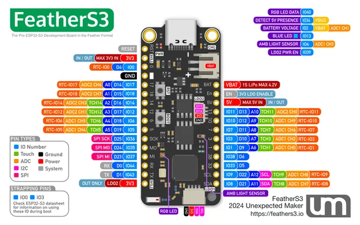

# FeatherS3

**Unexpected Maker** · ESP32-S3

Revision: Not identified  
Coverage: Pinout image collected

[Browse all manufacturers](../../../../BROWSE.md) · [Desktop app](https://github.com/valleytechsolutions/black-wire-desktop)

## Manufacturer board pinout

**pinout image** · Reviewed source · PNG

[Open original reference](../../../../library/media/cc22d021743d5759661cebcb758bc01d484c5e0c0ae0c1188f86a926696f691b.png)

**Credit and rights:** Not established; source attribution retained. Source/manufacturer: Unexpected Maker.

[Source 1](https://raw.githubusercontent.com/UnexpectedMaker/esp32s3/aa22c4a3a56539befe914a3b05787dc608d17b3a/Pinout%20Cards/FeatherS3_Pin_Reference.png) · [Source 2](https://github.com/UnexpectedMaker/esp32s3/blob/aa22c4a3a56539befe914a3b05787dc608d17b3a/Pinout%20Cards/FeatherS3_Pin_Reference.png)

Original image from the manufacturer documentation repository; exact commit recorded in source URL.

SHA-256: `cc22d021743d5759661cebcb758bc01d484c5e0c0ae0c1188f86a926696f691b`

Pin assignments have not been independently electrically verified. Check board revision before wiring.
