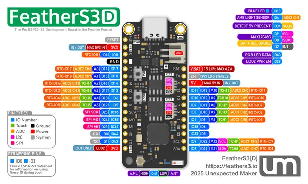

# FeatherS3D

**Unexpected Maker** · ESP32-S3

Revision: Not identified  
Coverage: Pinout image collected

[Browse all manufacturers](../../../../BROWSE.md) · [Desktop app](https://github.com/valleytechsolutions/black-wire-desktop)

## Manufacturer board pinout

**pinout image** · Reviewed source · JPG

[Open original reference](../../../../library/media/9736c710af7aecabdeea263be4849739e52ca6304ee0dbb3516c615049c5f44f.jpg)

**Credit and rights:** Not established; source attribution retained. Source/manufacturer: Unexpected Maker.

[Source 1](https://raw.githubusercontent.com/UnexpectedMaker/esp32s3/aa22c4a3a56539befe914a3b05787dc608d17b3a/series_d/pinout_cards/feathers3d_pinout.jpg) · [Source 2](https://github.com/UnexpectedMaker/esp32s3/blob/aa22c4a3a56539befe914a3b05787dc608d17b3a/series_d/pinout_cards/feathers3d_pinout.jpg)

Original image from the manufacturer documentation repository; exact commit recorded in source URL.

SHA-256: `9736c710af7aecabdeea263be4849739e52ca6304ee0dbb3516c615049c5f44f`

Pin assignments have not been independently electrically verified. Check board revision before wiring.
