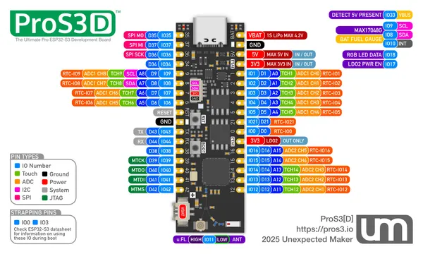

# ProS3D

**Unexpected Maker** · ESP32-S3

Revision: Not identified

Coverage: Pinout image collected

[Browse all manufacturers](../../../../BROWSE.md) · [Devices & IoT](../../../../DEVICES.md) · [Open in the browser guide](https://valleytech-black-wire-guide.pages.dev/?board=unexpected-maker-esp32-pros3d)

## Datasheets and original documentation

Board datasheet: **not yet recorded**. Visual reference: **available**.

Original manufacturer website still needs identification.

A chip datasheet, schematic and board datasheet have different scopes. Match the exact hardware revision.

[Documentation coverage and remaining gaps](../../../../DOCUMENTATION.md)

## Manufacturer board pinout

**pinout image** · Reviewed source · JPG

[Open original reference](../../../../library/media/a00baa2e309aaeaf29f385aa686c65f435a3acafd69c72ce76778fd4524e1029.jpg)

**Credit and rights:** Not established; source attribution retained. Source/manufacturer: Unexpected Maker.

[Source 1](https://raw.githubusercontent.com/UnexpectedMaker/esp32s3/aa22c4a3a56539befe914a3b05787dc608d17b3a/series_d/pinout_cards/pros3d_pinout.jpg) · [Source 2](https://github.com/UnexpectedMaker/esp32s3/blob/aa22c4a3a56539befe914a3b05787dc608d17b3a/series_d/pinout_cards/pros3d_pinout.jpg)

Original image from the manufacturer documentation repository; exact commit recorded in source URL.

Image revision: Not identified

SHA-256: `a00baa2e309aaeaf29f385aa686c65f435a3acafd69c72ce76778fd4524e1029`

Pin assignments have not been independently electrically verified. Check board revision before wiring.
