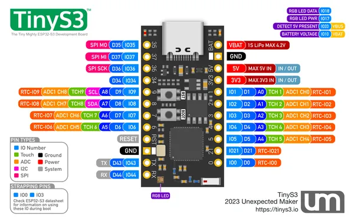

# TinyS3

**Unexpected Maker** · ESP32-S3

Revision: Not identified

Coverage: Pinout image collected

[Browse all manufacturers](../../../../BROWSE.md) · [Devices & IoT](../../../../DEVICES.md) · [Open in the browser guide](https://valleytech-black-wire-guide.pages.dev/?board=unexpected-maker-esp32-tinys3)

## Datasheets and original documentation

Board datasheet: **not yet recorded**. Visual reference: **available**.

[Manufacturer source (recorded link)](https://unexpectedmaker.com/shop/tinys3)

A chip datasheet, schematic and board datasheet have different scopes. Match the exact hardware revision.

[Documentation coverage and remaining gaps](../../../../DOCUMENTATION.md)

## Manufacturer board pinout

**pinout image** · Reviewed source · PNG

[Open original reference](../../../../library/media/e5233c7a8b927e2c6c9b51d2e1b30c18e128325c0ce689a920b0a41df6bb090b.png)

**Credit and rights:** Not established; source attribution retained. Source/manufacturer: Unexpected Maker.

[Source 1](https://raw.githubusercontent.com/UnexpectedMaker/esp32s3/aa22c4a3a56539befe914a3b05787dc608d17b3a/Pinout%20Cards/TinyS3_Pin_Reference.png) · [Source 2](https://github.com/UnexpectedMaker/esp32s3/blob/aa22c4a3a56539befe914a3b05787dc608d17b3a/Pinout%20Cards/TinyS3_Pin_Reference.png)

Original image from the manufacturer documentation repository; exact commit recorded in source URL.

Image revision: Not identified

SHA-256: `e5233c7a8b927e2c6c9b51d2e1b30c18e128325c0ce689a920b0a41df6bb090b`

Pin assignments have not been independently electrically verified. Check board revision before wiring.
