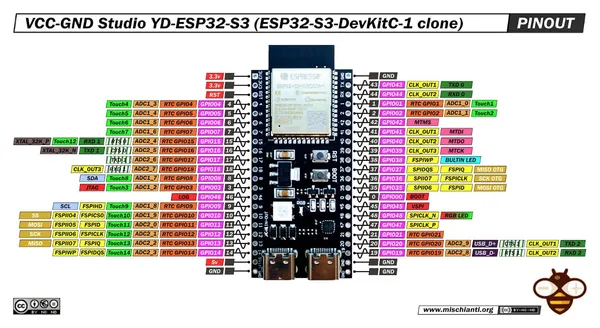
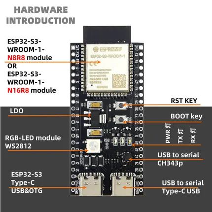

# YD-ESP32-S3

**VCC-GND Studio** · ESP32-S3

Revision: Multiple source/revision records; see individual assets  
Coverage: Pinout image collected

[Browse all manufacturers](../../../../BROWSE.md) · [Desktop app](https://github.com/valleytechsolutions/black-wire-desktop)

## Pinout - Renzo Mischianti

**pinout image** · Reviewed source · JPG

[Open original reference](../../../../library/media/fdea46c2951d93e37940af207debdb944dd2df3960f74558bedf8c56639aea94.jpg)

**Credit and rights:** CC BY-NC-ND marking visible on image; exact license version and publication permissions not established. Source/manufacturer: VCC-GND Studio.

[Source 1](https://mischianti.org/wp-content/uploads/2023/08/vcc-gnd-studio-yd-esp32-s3-devkitc-1-clone-pinout-mischianti-low-resolution-1.jpg) · [Source 2](https://mischianti.org/vcc-gnd-studio-yd-esp32-s3-devkitc-1-clone-high-resolution-pinout-and-specs/)

Original public image by Renzo Mischianti, unchanged. Diagram/model matching is visual, not electrical verification. Exact PCB layout and revision must match; no inference of compatibility with lookalike marketplace clones.

SHA-256: `fdea46c2951d93e37940af207debdb944dd2df3960f74558bedf8c56639aea94`

## Board silkscreen and component labels

**board labeling image** · Reviewed source · PNG

[Open original reference](../../../../library/media/ff9a2d8fc268c0983e5151396d34ebb2afcdfffa33dfe03e9f6dad76629c6d87.png)

**Credit and rights:** Not established; source attribution retained. Source/manufacturer: VCC-GND Studio.

[Source 1](https://raw.githubusercontent.com/vcc-gnd/YD-ESP32-S3/b4ac4d60d1845a554bbbc7c97806ccb97cf08941/5-public-YD-ESP32-S3-Hardware%20info/S3-V1.2%20%2814%29.PNG) · [Source 2](https://github.com/vcc-gnd/YD-ESP32-S3/blob/b4ac4d60d1845a554bbbc7c97806ccb97cf08941/5-public-YD-ESP32-S3-Hardware%20info/S3-V1.2%20%2814%29.PNG)

Original repository file preserved with commit identifier. Board illustration/silkscreen images are explicitly distinguished from expanded pin-function diagrams.

**Partial diagram. Confirm missing pins against the exact board documentation.**

SHA-256: `ff9a2d8fc268c0983e5151396d34ebb2afcdfffa33dfe03e9f6dad76629c6d87`

Pin assignments have not been independently electrically verified. Check board revision before wiring.
