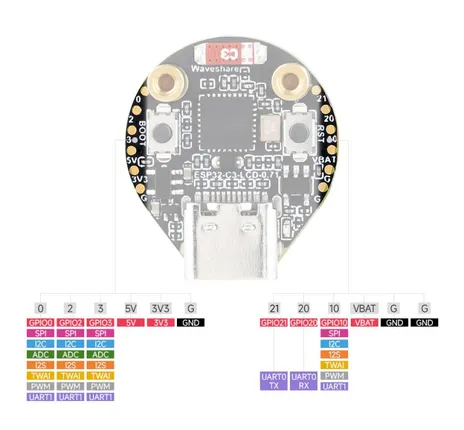

# ESP32-C3-LCD-0.71

**Waveshare** · ESP32-C3

Revision: Not identified  
Coverage: Pinout image collected

[Browse all manufacturers](../../../../BROWSE.md) · [Desktop app](https://github.com/valleytechsolutions/black-wire-desktop)

## Pinout

**pinout image** · Reviewed source · JPG

[Open original reference](../../../../library/media/e7322ac3864d1f3fbd7cd09b1b8a1c2b5a3301164f71529a4e993025da4adc6e.jpg)

**Credit and rights:** Not recorded; retain original attribution. Source/manufacturer: Waveshare.

[Source 1](https://www.waveshare.com/img/devkit/ESP32-C3-LCD-0.71/ESP32-C3-LCD-0.71-details-inter.jpg) · [Source 2](https://www.waveshare.com/esp32-c3-lcd-0.71.htm)

SHA-256: `e7322ac3864d1f3fbd7cd09b1b8a1c2b5a3301164f71529a4e993025da4adc6e`

## Pinout

**pinout image** · Reviewed source · JPG

[Open original reference](../../../../library/media/b562a6027948253474d5f11e2dcadad74be1eb61aa88eea63f23da6de5615ea0.jpg)

**Credit and rights:** Not recorded; retain original attribution. Source/manufacturer: Waveshare.

[Source 1](https://www.waveshare.com/w/upload/d/d7/800px-ESP32-C3-LCD-0.71-introduction-03.jpg) · [Source 2](https://www.waveshare.com/wiki/ESP32-C3-LCD-0.71)

SHA-256: `b562a6027948253474d5f11e2dcadad74be1eb61aa88eea63f23da6de5615ea0`

Pin assignments have not been independently electrically verified. Check board revision before wiring.
