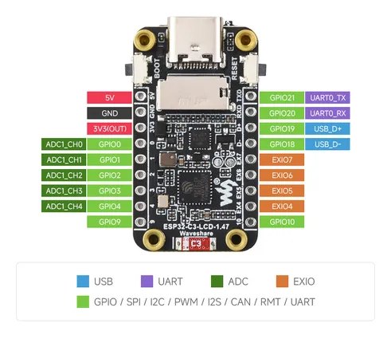
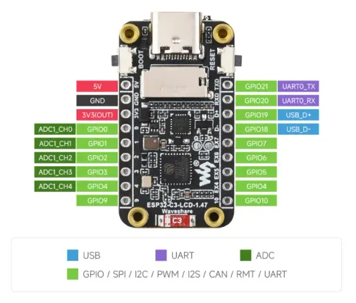

# ESP32-C3-LCD-1.47

**Waveshare** · ESP32-C3

Revision: Not identified  
Coverage: Pinout image collected

[Browse all manufacturers](../../../../BROWSE.md) · [Desktop app](https://github.com/valleytechsolutions/black-wire-desktop)

## Pinout

**pinout image** · Reviewed source · JPG

[Open original reference](../../../../library/media/c20124507333378a02f69e275a2e1b85817d2dd13dd3fd42b80302e11ea67a17.jpg)

**Credit and rights:** Not recorded; retain original attribution. Source/manufacturer: Waveshare.

[Source 1](https://www.waveshare.com/img/devkit/ESP32-C3-LCD-1.47/ESP32-C3-LCD-1.47-details-inter.jpg) · [Source 2](https://www.waveshare.com/esp32-c3-lcd-1.47.htm)

SHA-256: `c20124507333378a02f69e275a2e1b85817d2dd13dd3fd42b80302e11ea67a17`

## Pinout

**pinout image** · Reviewed source · WEBP

[Open original reference](../../../../library/media/0bbe78c4147a297dc62cf76365aa2bbd21e7d8ee7cfe40faae6119b01a3e13e9.webp)

**Credit and rights:** Not recorded; retain original attribution. Source/manufacturer: Waveshare.

[Source 1](https://docs.waveshare.com/assets/images/ESP32-C3-LCD-1.47-Pin-13eba78b9572bf35a56255278ce92613.webp) · [Source 2](https://docs.waveshare.com/ESP32-C3-LCD-1.47)

SHA-256: `0bbe78c4147a297dc62cf76365aa2bbd21e7d8ee7cfe40faae6119b01a3e13e9`

Pin assignments have not been independently electrically verified. Check board revision before wiring.
