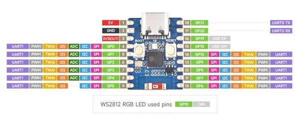
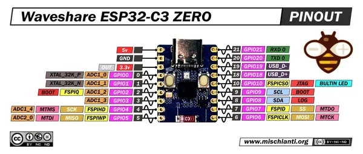

# ESP32-C3-Zero

**Waveshare** · ESP32-C3

Revision: Not identified  
Coverage: Pinout image collected

[Browse all manufacturers](../../../../BROWSE.md) · [Desktop app](https://github.com/valleytechsolutions/black-wire-desktop)

## Pinout

**pinout image** · Reviewed source · JPG

[Open original reference](../../../../library/media/00deae7a8ede452a7e24c5ccb22deb68cc3fcdc21721a62d64cb8dc1a0c32068.jpg)

**Credit and rights:** Not recorded; retain original attribution. Source/manufacturer: Waveshare.

[Source 1](https://www.waveshare.com/img/devkit/ESP32-C3-Zero/ESP32-C3-Zero-details-inter.jpg) · [Source 2](https://www.waveshare.com/esp32-c3-zero.htm)

SHA-256: `00deae7a8ede452a7e24c5ccb22deb68cc3fcdc21721a62d64cb8dc1a0c32068`

## Pinout

**pinout image** · Reviewed source · WEBP

[Open original reference](../../../../library/media/a97d848e3aea91918714771d1e59a8d9b81b1aa5673f8254ca1f1decde08a3fc.webp)

**Credit and rights:** Not recorded; retain original attribution. Source/manufacturer: Waveshare.

[Source 1](https://docs.waveshare.com/assets/images/ESP32-C3-Zero-Pinout-c3426b401a37b8255c56fe67d09708d6.webp) · [Source 2](https://docs.waveshare.com/ESP32-C3-Zero) · [Source 3](https://docs.waveshare.com/ESP32-C3-Zero )

SHA-256: `a97d848e3aea91918714771d1e59a8d9b81b1aa5673f8254ca1f1decde08a3fc`

## Pinout - Renzo Mischianti

**pinout image** · Reviewed source · JPG

[Open original reference](../../../../library/media/2e9014c777593b6ab7556f665046e7d935ac659346df60c77da90cd0c0dfe836.jpg)

**Credit and rights:** CC BY-NC-ND marking visible on image; exact license version and publication permissions not established. Source/manufacturer: Waveshare.

[Source 1](https://mischianti.org/wp-content/uploads/2025/07/ESP32-C3-ZERO-Waveshare-pinout-low.jpg) · [Source 2](https://mischianti.org/waveshare-esp32-c3-zero-high-resolution-pinout-datasheet-and-specs/)

Original public image by Renzo Mischianti, unchanged. Diagram/model matching is visual, not electrical verification. Exact PCB layout and revision must match; no inference of compatibility with lookalike marketplace clones.

SHA-256: `2e9014c777593b6ab7556f665046e7d935ac659346df60c77da90cd0c0dfe836`

Pin assignments have not been independently electrically verified. Check board revision before wiring.
