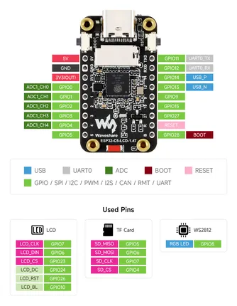

# ESP32-C5-LCD-1.47

**Waveshare** · ESP32-C5

Revision: Not identified  
Coverage: Pinout image collected

[Browse all manufacturers](../../../../BROWSE.md) · [Desktop app](https://github.com/valleytechsolutions/black-wire-desktop)

## Pinout

**pinout image** · Reviewed source · JPG

[Open original reference](../../../../library/media/d80e0ba8ffa314a8087bcaa278b0a0ca38cb24157d7c73092f20f9a14da221dc.jpg)

**Credit and rights:** Not recorded; retain original attribution. Source/manufacturer: Waveshare.

[Source 1](https://www.waveshare.com/img/devkit/ESP32-C5-LCD-1.47/ESP32-C5-LCD-1.47-details-inter.jpg) · [Source 2](https://www.waveshare.com/esp32-c5-lcd-1.47.htm)

SHA-256: `d80e0ba8ffa314a8087bcaa278b0a0ca38cb24157d7c73092f20f9a14da221dc`

Pin assignments have not been independently electrically verified. Check board revision before wiring.
