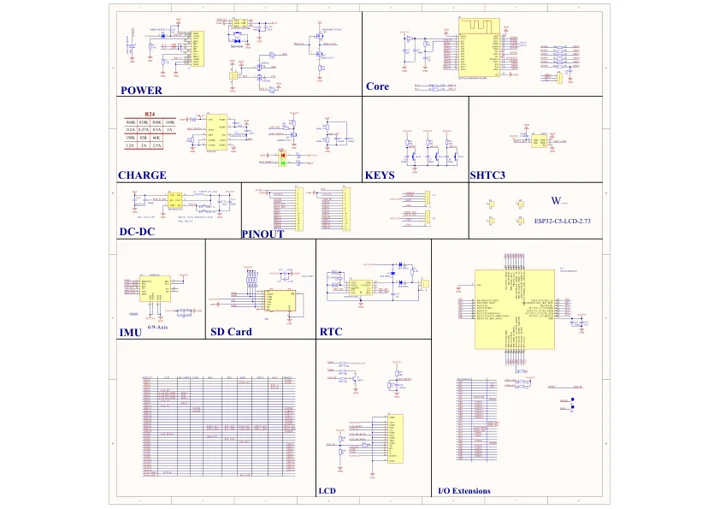

# ESP32-C5-LCD-2.73

**Waveshare** · ESP32-C5

Revision: Not identified

Coverage: Manufacturer references reviewed by scope; independent electrical and all-connector review pending

[Browse all manufacturers](../../../../BROWSE.md) · [Devices & IoT](../../../../DEVICES.md) · [Open in the browser guide](https://valleytech-black-wire-guide.pages.dev/?board=waveshare-esp32-esp32-c5-lcd-2-73)

## Datasheets and original documentation

Board datasheet: **not yet recorded**. Visual reference: **available**.

[Manufacturer hardware documentation](https://docs.waveshare.com/ESP32-C5-LCD-2.73/Resources-And-Documents)

- **schematic / board**: [ESP32-C5-LCD-2.73 Schematic Diagram](https://github.com/waveshareteam/ESP32-C5-LCD-2.73/raw/main/schematic/ESP32-C5-LCD-2.73.pdf) · [saved document](../../../../library/media/b698481c0cb5b838942da326b7e1474293c61eed1cfc443ce4bc92f64febc103.pdf)
- **hardware-guide / board**: [Manufacturer pin and hardware documentation](https://docs.waveshare.com/ESP32-C5-LCD-2.73/Resources-And-Documents) · online

A chip datasheet, schematic and board datasheet have different scopes. Match the exact hardware revision.

[Documentation coverage and remaining gaps](../../../../DOCUMENTATION.md)

## ESP32-C5-LCD-2.73 Schematic Diagram

**original reference PDF** · Source identity and visual scope inspected; PDF review covers first-page preview. Independent electrical and all-connector completeness review pending. · PDF

[Open original reference](../../../../library/media/b698481c0cb5b838942da326b7e1474293c61eed1cfc443ce4bc92f64febc103.pdf)

**Credit and rights:** Manufacturer artwork; reuse and print rights not established. Inclusion does not relicense the original.. Source/manufacturer: Waveshare.

[Source 1](https://github.com/waveshareteam/ESP32-C5-LCD-2.73/raw/main/schematic/ESP32-C5-LCD-2.73.pdf) · [Source 2](https://docs.waveshare.com/ESP32-C5-LCD-2.73/Resources-And-Documents)

Manufacturer source retained unchanged. Source identity and visual scope inspected; PDF review covers first-page preview. Independent electrical and all-connector completeness review pending.

Image revision: As supplied in the original; match exact board revision

SHA-256: `b698481c0cb5b838942da326b7e1474293c61eed1cfc443ce4bc92f64febc103`

Pin assignments have not been independently electrically verified. Check board revision before wiring.
