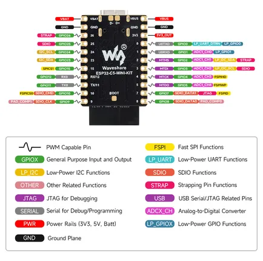
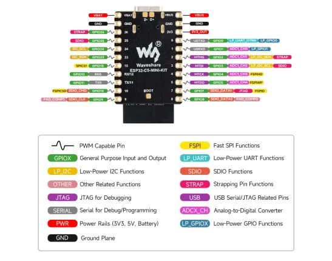

# ESP32-C5-MINI-KIT

**Waveshare** · ESP32-C5

Revision: Not identified  
Coverage: Pinout image collected

[Browse all manufacturers](../../../../BROWSE.md) · [Desktop app](https://github.com/valleytechsolutions/black-wire-desktop)

## Pinout

**pinout image** · Reviewed source · JPG

[Open original reference](../../../../library/media/2aca193a406c1f53cf8df507c4610040db0117199793ab3544b7d20fe07a4d79.jpg)

**Credit and rights:** Not recorded; retain original attribution. Source/manufacturer: Waveshare.

[Source 1](https://www.waveshare.com/img/devkit/ESP32-C5-MINI-KIT/ESP32-C5-MINI-KIT-details-inter.jpg) · [Source 2](https://www.waveshare.com/esp32-c5-mini-kit.htm)

SHA-256: `2aca193a406c1f53cf8df507c4610040db0117199793ab3544b7d20fe07a4d79`

## Pinout

**pinout image** · Reviewed source · WEBP

[Open original reference](../../../../library/media/408f5f8285d35d617de18edf194bfd10c32b36a060b30a4cd3b0e61a80eca747.webp)

**Credit and rights:** Not recorded; retain original attribution. Source/manufacturer: Waveshare.

[Source 1](https://docs.waveshare.com/assets/images/ESP32-C5-MINI-KIT-size-7f310511b392c2224568de3e279d5849.webp) · [Source 2](https://docs.waveshare.com/ESP32-C5-MINI-KIT)

SHA-256: `408f5f8285d35d617de18edf194bfd10c32b36a060b30a4cd3b0e61a80eca747`

Pin assignments have not been independently electrically verified. Check board revision before wiring.
