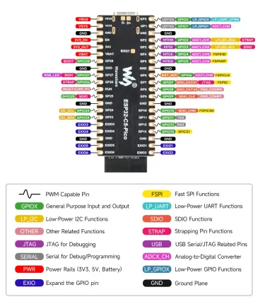

# ESP32-C5-Pico

**Waveshare** · ESP32-C5

Revision: Not identified  
Coverage: Pinout image collected

[Browse all manufacturers](../../../../BROWSE.md) · [Desktop app](https://github.com/valleytechsolutions/black-wire-desktop)

## Pinout

**pinout image** · Reviewed source · JPG

[Open original reference](../../../../library/media/695a488243b2ffb0f377be85c08ad206b56d98fbc34b5918896b07fa26135c30.jpg)

**Credit and rights:** Not recorded; retain original attribution. Source/manufacturer: Waveshare.

[Source 1](https://www.waveshare.com/img/devkit/ESP32-C5-Pico/ESP32-C5-Pico-details-inter.jpg) · [Source 2](https://www.waveshare.com/esp32-c5-pico.htm)

SHA-256: `695a488243b2ffb0f377be85c08ad206b56d98fbc34b5918896b07fa26135c30`

## Pinout

**pinout image** · Reviewed source · WEBP

[Open original reference](../../../../library/media/cea8ba576630f80bf097ad749d3b4c9407ab0446baa52e5de7492a188b20fc5b.webp)

**Credit and rights:** Not recorded; retain original attribution. Source/manufacturer: Waveshare.

[Source 1](https://docs.waveshare.com/assets/images/ESP32-C5-Pico-GPIO-9e303b827787a1a6ea8d67a996662f44.webp) · [Source 2](https://docs.waveshare.com/ESP32-C5-Pico)

SHA-256: `cea8ba576630f80bf097ad749d3b4c9407ab0446baa52e5de7492a188b20fc5b`

Pin assignments have not been independently electrically verified. Check board revision before wiring.
