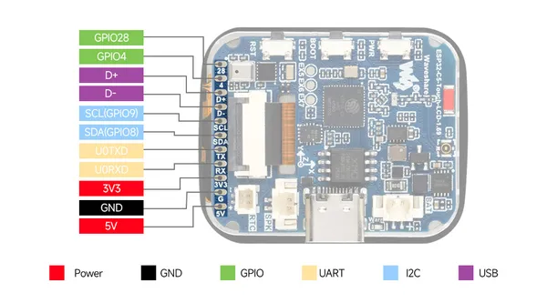
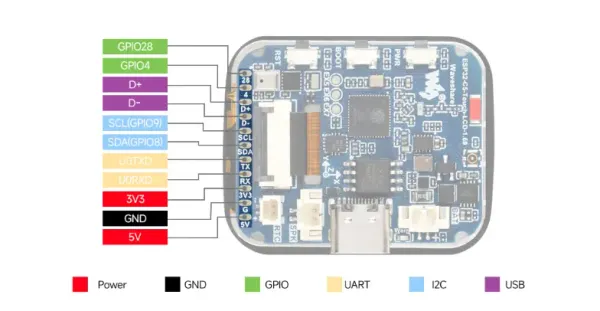

# ESP32-C5-Touch-LCD-1.69

**Waveshare** · ESP32-C5

Revision: Not identified  
Coverage: Pinout image collected

[Browse all manufacturers](../../../../BROWSE.md) · [Desktop app](https://github.com/valleytechsolutions/black-wire-desktop)

## Pinout

**pinout image** · Reviewed source · JPG

[Open original reference](../../../../library/media/9dec45d4a05b43a3f7d42c83fc11c4dfb8f6df5b5007e7c5a34f7fa87edede93.jpg)

**Credit and rights:** Not recorded; retain original attribution. Source/manufacturer: Waveshare.

[Source 1](https://www.waveshare.com/img/devkit/ESP32-C5-Touch-LCD-1.69/ESP32-C5-Touch-LCD-1.69-details-inter.jpg?v=260610) · [Source 2](https://www.waveshare.com/esp32-c5-touch-lcd-1.69.htm)

SHA-256: `9dec45d4a05b43a3f7d42c83fc11c4dfb8f6df5b5007e7c5a34f7fa87edede93`

## Pinout

**pinout image** · Reviewed source · WEBP

[Open original reference](../../../../library/media/008bac5fd5eb8b3352ca4b4647427eef610b5234164be4e3843c0bd027f79ae8.webp)

**Credit and rights:** Not recorded; retain original attribution. Source/manufacturer: Waveshare.

[Source 1](https://docs.waveshare.com/assets/images/ESP32-C5-Touch-LCD-1.69-produce-02-cca271f84da2257927c827d97aeb1128.webp) · [Source 2](https://docs.waveshare.com/ESP32-C5-Touch-LCD-1.69)

SHA-256: `008bac5fd5eb8b3352ca4b4647427eef610b5234164be4e3843c0bd027f79ae8`

Pin assignments have not been independently electrically verified. Check board revision before wiring.
