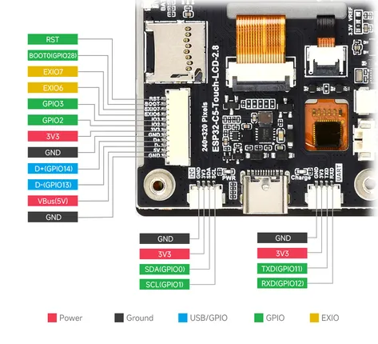
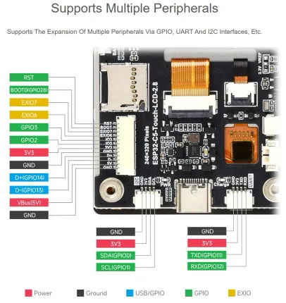

# ESP32-C5-Touch-LCD-2.8

**Waveshare** · ESP32-C5

Revision: Not identified  
Coverage: Pinout image collected

[Browse all manufacturers](../../../../BROWSE.md) · [Desktop app](https://github.com/valleytechsolutions/black-wire-desktop)

## Pinout

**pinout image** · Reviewed source · JPG

[Open original reference](../../../../library/media/73b21df2980608cfd535ffb2979e90949d99678b6620d2f00bbf93cb277fe0be.jpg)

**Credit and rights:** Not recorded; retain original attribution. Source/manufacturer: Waveshare.

[Source 1](https://www.waveshare.com/img/devkit/ESP32-C5-Touch-LCD-2.8/ESP32-C5-Touch-LCD-2.8-details-7.jpg) · [Source 2](https://www.waveshare.com/esp32-c5-touch-lcd-2.8.htm)

SHA-256: `73b21df2980608cfd535ffb2979e90949d99678b6620d2f00bbf93cb277fe0be`

## Pinout

**pinout image** · Reviewed source · WEBP

[Open original reference](../../../../library/media/23df9c9e8d03761bf4e7eb35b5487afe2a7dc307d6fce50a45fbd4e3f341f9ab.webp)

**Credit and rights:** Not recorded; retain original attribution. Source/manufacturer: Waveshare.

[Source 1](https://docs.waveshare.com/assets/images/2.8-3-abeb2d8b6bbe1c205ccc87b71f9df2b7.webp) · [Source 2](https://docs.waveshare.com/ESP32-C5-Touch-LCD-2.8)

SHA-256: `23df9c9e8d03761bf4e7eb35b5487afe2a7dc307d6fce50a45fbd4e3f341f9ab`

Pin assignments have not been independently electrically verified. Check board revision before wiring.
