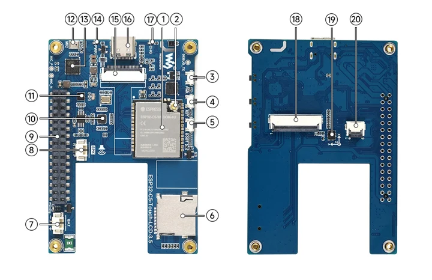
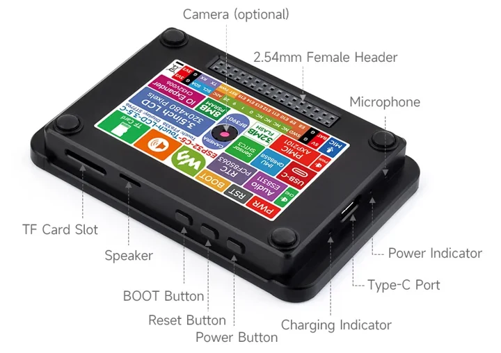
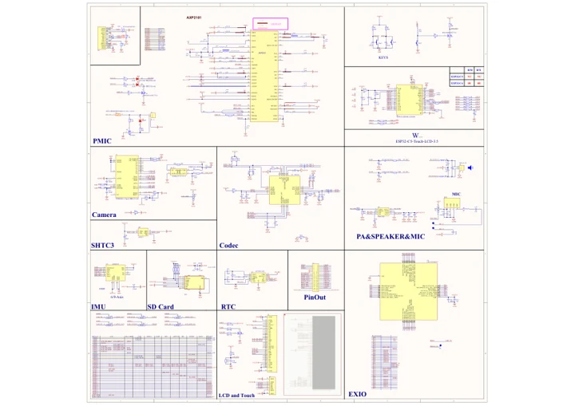

# ESP32-C5-Touch-LCD-3.5

**Waveshare** · ESP32-C5

Revision: Not identified

Coverage: Manufacturer references reviewed by scope; independent electrical and all-connector review pending

[Browse all manufacturers](../../../../BROWSE.md) · [Devices & IoT](../../../../DEVICES.md) · [Open in the browser guide](https://valleytech-black-wire-guide.pages.dev/?board=waveshare-esp32-esp32-c5-touch-lcd-3-5)

## Datasheets and original documentation

Board datasheet: **not yet recorded**. Visual reference: **available**.

[Manufacturer hardware documentation](https://docs.waveshare.com/ESP32-C5-Touch-LCD-3.5)

- **schematic / board**: [ESP32-C5-Touch-LCD-3.5 Schematic](https://github.com/waveshareteam/ESP32-C5-Touch-LCD-3.5/raw/main/schematic/ESP32-C5-Touch-LCD-3.5.pdf) · [saved document](../../../../library/media/b2140f11620022301fe3c92d5c003e6d6b9e1db9cb111cd54f892eeb7a840485.pdf)
- **hardware-guide / board**: [Manufacturer pin and hardware documentation](https://docs.waveshare.com/ESP32-C5-Touch-LCD-3.5) · online

A chip datasheet, schematic and board datasheet have different scopes. Match the exact hardware revision.

[Documentation coverage and remaining gaps](../../../../DOCUMENTATION.md)

## Onboard Resources ​

**board labeling image** · Source identity and visual scope inspected; PDF review covers first-page preview. Independent electrical and all-connector completeness review pending. · WEBP

[Open original reference](../../../../library/media/a1520f3a56024749346c3a096453ec1f62e5caaca8a3fb7bfe8aa12cb100bf74.webp)

**Credit and rights:** Manufacturer artwork; reuse and print rights not established. Inclusion does not relicense the original.. Source/manufacturer: Waveshare.

[Source 1](https://docs.waveshare.com/assets/images/C5-3.5-Resources-5edc8d0466e806fc6354d6a45cf89a97.webp) · [Source 2](https://docs.waveshare.com/ESP32-C5-Touch-LCD-3.5)

Manufacturer source retained unchanged. Source identity and visual scope inspected; PDF review covers first-page preview. Independent electrical and all-connector completeness review pending. See the linked manufacturer page for the numbered component legend. This is not a complete physical pinout.

Image revision: As supplied in the original; match exact board revision

SHA-256: `a1520f3a56024749346c3a096453ec1f62e5caaca8a3fb7bfe8aa12cb100bf74`

## Interface Introduction ​

**board labeling image** · Source identity and visual scope inspected; PDF review covers first-page preview. Independent electrical and all-connector completeness review pending. · WEBP

[Open original reference](../../../../library/media/0a6253977a8864d582f7c9c5abb79e4cda7adbe0840fdc77807163ddfb65fb9c.webp)

**Credit and rights:** Manufacturer artwork; reuse and print rights not established. Inclusion does not relicense the original.. Source/manufacturer: Waveshare.

[Source 1](https://docs.waveshare.com/assets/images/C5-3.5-Interfaces-96950f2d84457f0b7c957e3c5f278dd3.webp) · [Source 2](https://docs.waveshare.com/ESP32-C5-Touch-LCD-3.5)

Manufacturer source retained unchanged. Source identity and visual scope inspected; PDF review covers first-page preview. Independent electrical and all-connector completeness review pending. See the linked manufacturer page for the numbered component legend. This is not a complete physical pinout.

Image revision: As supplied in the original; match exact board revision

SHA-256: `0a6253977a8864d582f7c9c5abb79e4cda7adbe0840fdc77807163ddfb65fb9c`

## ESP32-C5-Touch-LCD-3.5 Schematic

**original reference PDF** · Source identity and visual scope inspected; PDF review covers first-page preview. Independent electrical and all-connector completeness review pending. · PDF

[Open original reference](../../../../library/media/b2140f11620022301fe3c92d5c003e6d6b9e1db9cb111cd54f892eeb7a840485.pdf)

**Credit and rights:** Manufacturer artwork; reuse and print rights not established. Inclusion does not relicense the original.. Source/manufacturer: Waveshare.

[Source 1](https://github.com/waveshareteam/ESP32-C5-Touch-LCD-3.5/raw/main/schematic/ESP32-C5-Touch-LCD-3.5.pdf) · [Source 2](https://docs.waveshare.com/ESP32-C5-Touch-LCD-3.5/Resources-And-Documents)

Manufacturer source retained unchanged. Source identity and visual scope inspected; PDF review covers first-page preview. Independent electrical and all-connector completeness review pending.

Image revision: As supplied in the original; match exact board revision

SHA-256: `b2140f11620022301fe3c92d5c003e6d6b9e1db9cb111cd54f892eeb7a840485`

Pin assignments have not been independently electrically verified. Check board revision before wiring.
