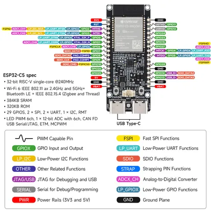
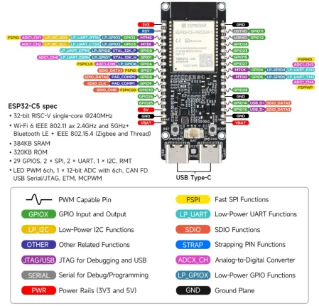
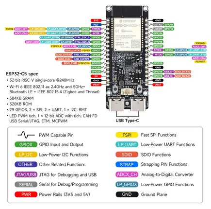

# ESP32-C5-WIFI6-KIT

**Waveshare** · ESP32-C5

Revision: Not identified  
Coverage: Pinout image collected

[Browse all manufacturers](../../../../BROWSE.md) · [Desktop app](https://github.com/valleytechsolutions/black-wire-desktop)

## Pinout

**pinout image** · Reviewed source · JPG

[Open original reference](../../../../library/media/f7f6b138e2393b566ec32cab8f64f783644ee140495e451b939f738542f60d13.jpg)

**Credit and rights:** Not recorded; retain original attribution. Source/manufacturer: Waveshare.

[Source 1](https://www.waveshare.com/img/devkit/ESP32-C5-WIFI6-KIT-N16R4/ESP32-C5-WIFI6-KIT-N16R8-details-inter.jpg) · [Source 2](https://www.waveshare.com/esp32-c5-wifi6-kit-n16r4.htm)

SHA-256: `f7f6b138e2393b566ec32cab8f64f783644ee140495e451b939f738542f60d13`

## Pinout

**pinout image** · Reviewed source · WEBP

[Open original reference](../../../../library/media/18fe62e064ed66349c590746a0aee7b41fe45bba931a94cfeadb63d989318ae9.webp)

**Credit and rights:** Not recorded; retain original attribution. Source/manufacturer: Waveshare.

[Source 1](https://docs.waveshare.com/assets/images/ESP32-C5-WIFI6-KIT-Pins-f8830b7a5b51bb870d174e23b4c9b815.webp) · [Source 2](https://docs.waveshare.com/ESP32-C5-WIFI6-KIT)

SHA-256: `18fe62e064ed66349c590746a0aee7b41fe45bba931a94cfeadb63d989318ae9`

## Pinout

**pinout image** · Reviewed source · JPG

[Open original reference](../../../../library/media/15c1a4a32251e0454596a172469f8eb0bce59016ab41e34ed9ff3b48ab14c624.jpg)

**Credit and rights:** Not recorded; retain original attribution. Source/manufacturer: Waveshare.

[Source 1](https://www.waveshare.com/w/upload/5/5b/ESP32-C5-WIFI6-KIT-N16R4-details-inter.jpg) · [Source 2](https://www.waveshare.com/wiki/ESP32-C5-WIFI6-KIT-N16R4) · [Source 3](https://www.waveshare.com/wiki/ESP32-C5-WIFI6-KIT-NXRX)

SHA-256: `15c1a4a32251e0454596a172469f8eb0bce59016ab41e34ed9ff3b48ab14c624`

Pin assignments have not been independently electrically verified. Check board revision before wiring.
