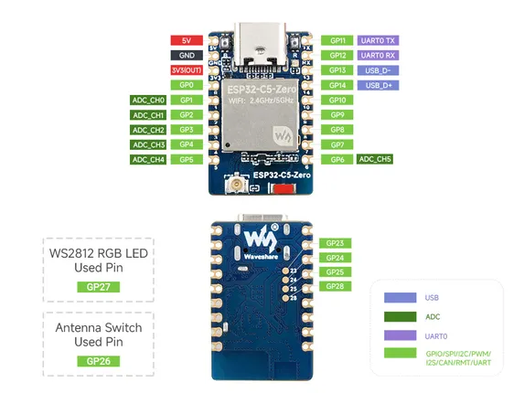
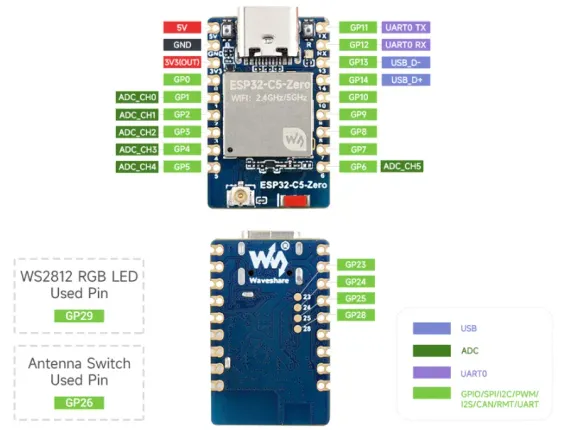

# ESP32-C5-Zero

**Waveshare** · ESP32-C5

Revision: Not identified  
Coverage: Pinout image collected

[Browse all manufacturers](../../../../BROWSE.md) · [Desktop app](https://github.com/valleytechsolutions/black-wire-desktop)

## Pinout

**pinout image** · Reviewed source · JPG

[Open original reference](../../../../library/media/1af03ceda605bc2f3a9d7577c6d49572f867031f5d61ae9b525e2555922d65b0.jpg)

**Credit and rights:** Not recorded; retain original attribution. Source/manufacturer: Waveshare.

[Source 1](https://www.waveshare.com/img/devkit/ESP32-C5-Zero/ESP32-C5-Zero-details-inter.jpg) · [Source 2](https://www.waveshare.com/esp32-c5-zero.htm)

SHA-256: `1af03ceda605bc2f3a9d7577c6d49572f867031f5d61ae9b525e2555922d65b0`

## Pinout

**pinout image** · Reviewed source · WEBP

[Open original reference](../../../../library/media/d17be96139e6424ef97b44d473fb7e11f6339b087dcf929097e26172f967dfb0.webp)

**Credit and rights:** Not recorded; retain original attribution. Source/manufacturer: Waveshare.

[Source 1](https://docs.waveshare.com/assets/images/ESP32-C5-Zero-Pin-29de88588448da0be2af9f7e851e5adb.webp) · [Source 2](https://docs.waveshare.com/ESP32-C5-Zero)

SHA-256: `d17be96139e6424ef97b44d473fb7e11f6339b087dcf929097e26172f967dfb0`

Pin assignments have not been independently electrically verified. Check board revision before wiring.
