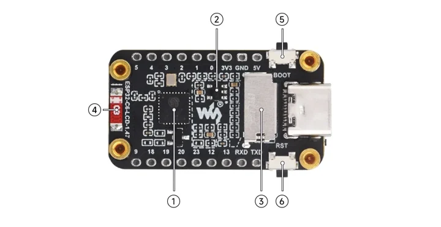
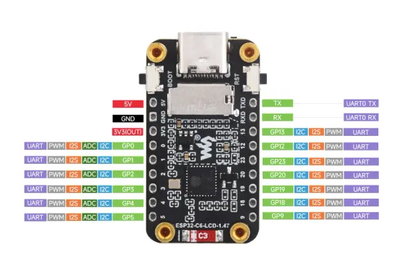
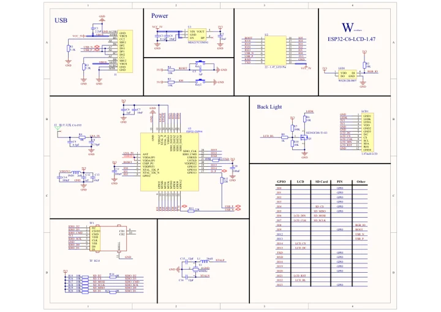

# ESP32-C6 1.47inch Display Development Board

**Waveshare** · ESP32-C6

Revision: Not identified

Coverage: Manufacturer references reviewed by scope; independent electrical and all-connector review pending

[Browse all manufacturers](../../../../BROWSE.md) · [Devices & IoT](../../../../DEVICES.md) · [Open in the browser guide](https://valleytech-black-wire-guide.pages.dev/?board=waveshare-esp32-esp32-c6-1-47inch-display-development-board)

## Datasheets and original documentation

Board datasheet: **not yet recorded**. Visual reference: **available**.

[Manufacturer hardware documentation](https://docs.waveshare.com/ESP32-C6-LCD-1.47)

- **hardware-guide / board**: [Board hardware guide](https://docs.waveshare.com/ESP32-C6-LCD-1.47) · online
- **schematic / recorded-source**: [ESP32-C6-LCD-1.47 Schematic Diagram](https://files.waveshare.com/wiki/ESP32-C6-LCD-1.47/ESP32-C6-LCD-1.47_schemetics.pdf) · [saved document](../../../../library/media/d8ded2da08268e27148c700b38c2b1ba62bca2b734153c7c6e88ecc5e5c72e51.pdf)

A chip datasheet, schematic and board datasheet have different scopes. Match the exact hardware revision.

[Documentation coverage and remaining gaps](../../../../DOCUMENTATION.md)

## Onboard Resources ​

**board labeling image** · Source identity and visual scope inspected; PDF review covers first-page preview. Independent electrical and all-connector completeness review pending. · WEBP

[Open original reference](../../../../library/media/960c0dd4c6392966ac4290d01c53cf439fac5d844a64875a82199e61ab6644b7.webp)

**Credit and rights:** Manufacturer artwork; reuse and print rights not established. Inclusion does not relicense the original.. Source/manufacturer: Waveshare.

[Source 1](https://docs.waveshare.com/assets/images/ESP32-C6-LCD-1.47-3-29686f27ea9ae8d84b966c692383054b.webp) · [Source 2](https://docs.waveshare.com/ESP32-C6-LCD-1.47)

Manufacturer source retained unchanged. Source identity and visual scope inspected; PDF review covers first-page preview. Independent electrical and all-connector completeness review pending. See the linked manufacturer page for the numbered component legend. This is not a complete physical pinout.

Image revision: As supplied in the original; match exact board revision

SHA-256: `960c0dd4c6392966ac4290d01c53cf439fac5d844a64875a82199e61ab6644b7`

## Interface Introduction ​

**pinout image** · Source identity and visual scope inspected; PDF review covers first-page preview. Independent electrical and all-connector completeness review pending. · WEBP

[Open original reference](../../../../library/media/2ee57b52bf705b8cd3db8f994f3f597e969b8d5728f80d5fdb140502e91da5ae.webp)

**Credit and rights:** Manufacturer artwork; reuse and print rights not established. Inclusion does not relicense the original.. Source/manufacturer: Waveshare.

[Source 1](https://docs.waveshare.com/assets/images/ESP32-C6-LCD-1.47-4-e0c537b216e775b3dd53555a9bc5aada.webp) · [Source 2](https://docs.waveshare.com/ESP32-C6-LCD-1.47)

Manufacturer source retained unchanged. Source identity and visual scope inspected; PDF review covers first-page preview. Independent electrical and all-connector completeness review pending.

Image revision: As supplied in the original; match exact board revision

SHA-256: `2ee57b52bf705b8cd3db8f994f3f597e969b8d5728f80d5fdb140502e91da5ae`

## ESP32-C6-LCD-1.47 Schematic Diagram

**original reference PDF** · Source identity and visual scope inspected; PDF review covers first-page preview. Independent electrical and all-connector completeness review pending. · PDF

[Open original reference](../../../../library/media/d8ded2da08268e27148c700b38c2b1ba62bca2b734153c7c6e88ecc5e5c72e51.pdf)

**Credit and rights:** Manufacturer artwork; reuse and print rights not established. Inclusion does not relicense the original.. Source/manufacturer: Waveshare.

[Source 1](https://files.waveshare.com/wiki/ESP32-C6-LCD-1.47/ESP32-C6-LCD-1.47_schemetics.pdf) · [Source 2](https://docs.waveshare.com/ESP32-C6-LCD-1.47/Resources-And-Documents)

Manufacturer source retained unchanged. Source identity and visual scope inspected; PDF review covers first-page preview. Independent electrical and all-connector completeness review pending.

Image revision: As supplied in the original; match exact board revision

SHA-256: `d8ded2da08268e27148c700b38c2b1ba62bca2b734153c7c6e88ecc5e5c72e51`

Pin assignments have not been independently electrically verified. Check board revision before wiring.
