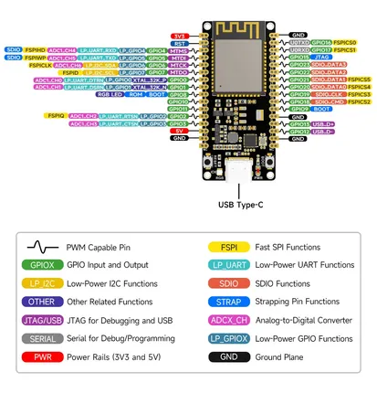
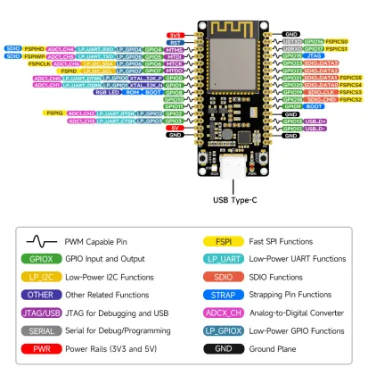
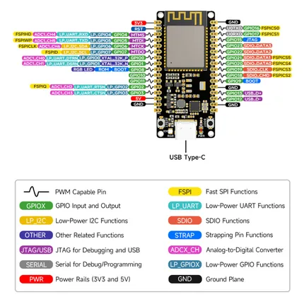

# ESP32-C6-DEV-KIT-N8

**Waveshare** · ESP32-C6

Revision: Not identified  
Coverage: Pinout image collected

[Browse all manufacturers](../../../../BROWSE.md) · [Desktop app](https://github.com/valleytechsolutions/black-wire-desktop)

## Pinout

**pinout image** · Reviewed source · JPG

[Open original reference](../../../../library/media/bb915ef09d941df55ac3fbfc7d73647a2c6e4ab7af9f53772b95105fe457cf44.jpg)

**Credit and rights:** Not recorded; retain original attribution. Source/manufacturer: Waveshare.

[Source 1](https://www.waveshare.com/img/devkit/ESP32-C6-DEV-KIT-N8/ESP32-C6-DEV-KIT-N8-details-9.jpg) · [Source 2](https://www.waveshare.com/esp32-c6-dev-kit-n8.htm)

SHA-256: `bb915ef09d941df55ac3fbfc7d73647a2c6e4ab7af9f53772b95105fe457cf44`

## Pinout

**pinout image** · Reviewed source · WEBP

[Open original reference](../../../../library/media/a888a269f80b332d1a55b793ede156d63a60e6ba85edc6879c67efd1914758e5.webp)

**Credit and rights:** Not recorded; retain original attribution. Source/manufacturer: Waveshare.

[Source 1](https://docs.waveshare.com/assets/images/ESP32-C6-DEV-KIT-N8_Pin_Configuration-f4ad4f9f74a6c28eecf9632d812287db.webp) · [Source 2](https://docs.waveshare.com/ESP32-C6-DEV-KIT-N8)

SHA-256: `a888a269f80b332d1a55b793ede156d63a60e6ba85edc6879c67efd1914758e5`

## Pinout

**pinout image** · Reviewed source · PNG

[Open original reference](../../../../library/media/dafce72e4ab1db0f938d784a9cf1acf80a0e2c136f60ad801b7be8ef93839801.png)

**Credit and rights:** Not recorded; retain original attribution. Source/manufacturer: Waveshare.

[Source 1](https://www.waveshare.com/w/upload/0/01/ESP32-C6-DEV-KIT-N805.png) · [Source 2](https://www.waveshare.com/wiki/ESP32-C6-DEV-KIT-N8)

SHA-256: `dafce72e4ab1db0f938d784a9cf1acf80a0e2c136f60ad801b7be8ef93839801`

Pin assignments have not been independently electrically verified. Check board revision before wiring.
