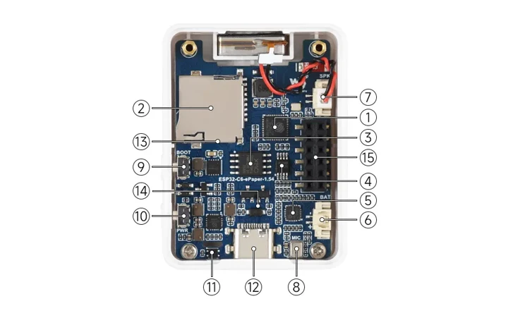
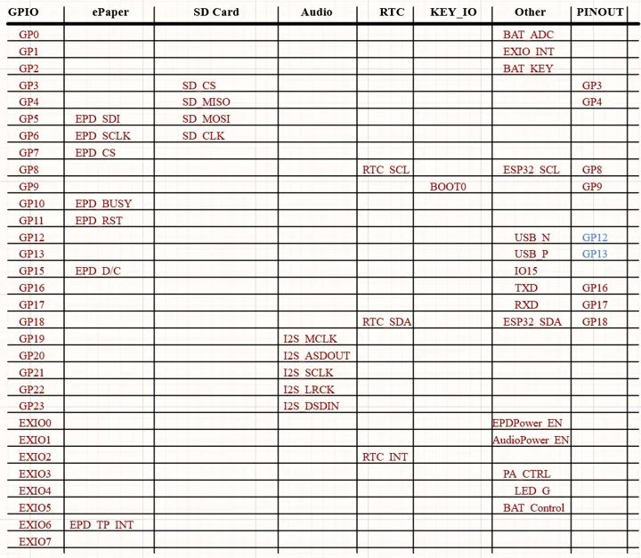

# ESP32-C6-ePaper-1.54

**Waveshare** · ESP32-C6

Revision: Not identified

Coverage: Manufacturer references reviewed by scope; independent electrical and all-connector review pending

[Browse all manufacturers](../../../../BROWSE.md) · [Devices & IoT](../../../../DEVICES.md) · [Open in the browser guide](https://valleytech-black-wire-guide.pages.dev/?board=waveshare-esp32-esp32-c6-epaper-1-54)

## Datasheets and original documentation

Board datasheet: **not yet recorded**. Visual reference: **available**.

[Manufacturer hardware documentation](https://docs.waveshare.com/ESP32-C6-ePaper-1.54)

- **hardware-guide / board**: [Manufacturer pin and hardware documentation](https://docs.waveshare.com/ESP32-C6-ePaper-1.54) · online

A chip datasheet, schematic and board datasheet have different scopes. Match the exact hardware revision.

[Documentation coverage and remaining gaps](../../../../DOCUMENTATION.md)

## Onboard Resources ​

**board labeling image** · Source identity and visual scope inspected; PDF review covers first-page preview. Independent electrical and all-connector completeness review pending. · WEBP

[Open original reference](../../../../library/media/92e7df267b00a571744a06f638c87d7ce68805fa383a1b18947d4d7449b720dd.webp)

**Credit and rights:** Manufacturer artwork; reuse and print rights not established. Inclusion does not relicense the original.. Source/manufacturer: Waveshare.

[Source 1](https://docs.waveshare.com/assets/images/ESP32-C6-ePaper-1.54-HW-2ba87c2648aeaeaaee9d5d075339f592.webp) · [Source 2](https://docs.waveshare.com/ESP32-C6-ePaper-1.54)

Manufacturer source retained unchanged. Source identity and visual scope inspected; PDF review covers first-page preview. Independent electrical and all-connector completeness review pending. See the linked manufacturer page for the numbered component legend. This is not a complete physical pinout.

Image revision: As supplied in the original; match exact board revision

SHA-256: `92e7df267b00a571744a06f638c87d7ce68805fa383a1b18947d4d7449b720dd`

## Interface Introduction ​

**pin function reference** · Source identity and visual scope inspected; PDF review covers first-page preview. Independent electrical and all-connector completeness review pending. · WEBP

[Open original reference](../../../../library/media/d842bb09af8080ae291292d17e952f9369faf9646aa65746de31b61a97fb935e.webp)

**Credit and rights:** Manufacturer artwork; reuse and print rights not established. Inclusion does not relicense the original.. Source/manufacturer: Waveshare.

[Source 1](https://docs.waveshare.com/assets/images/ESP32-C6-ePaper-1.54-IntfIntro-3f2591fee77a7dd55cd1d83081fa2338.webp) · [Source 2](https://docs.waveshare.com/ESP32-C6-ePaper-1.54)

Manufacturer source retained unchanged. Source identity and visual scope inspected; PDF review covers first-page preview. Independent electrical and all-connector completeness review pending.

Image revision: As supplied in the original; match exact board revision

SHA-256: `d842bb09af8080ae291292d17e952f9369faf9646aa65746de31b61a97fb935e`

Pin assignments have not been independently electrically verified. Check board revision before wiring.
