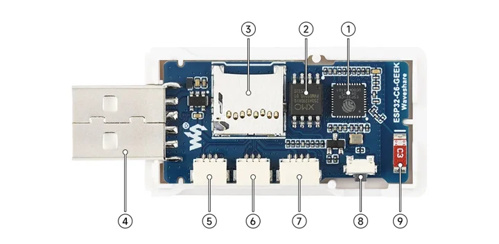
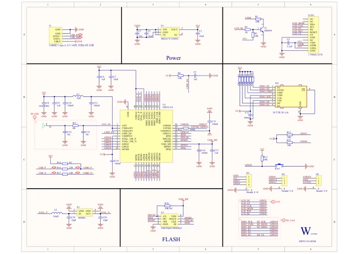
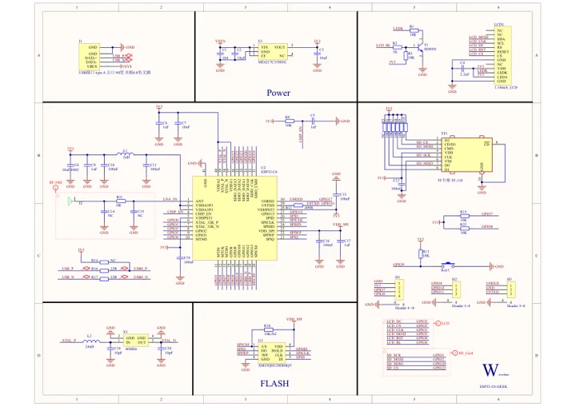

# ESP32-C6-GEEK

**Waveshare** · ESP32-C6

Revision: Not identified

Coverage: Manufacturer references reviewed by scope; independent electrical and all-connector review pending

[Browse all manufacturers](../../../../BROWSE.md) · [Devices & IoT](../../../../DEVICES.md) · [Open in the browser guide](https://valleytech-black-wire-guide.pages.dev/?board=waveshare-esp32-esp32-c6-geek)

## Datasheets and original documentation

Board datasheet: **not yet recorded**. Visual reference: **available**.

[Manufacturer hardware documentation](https://docs.waveshare.com/ESP32-C6-GEEK)

- **schematic / board**: [ESP32-C6-GEEK Schematic](https://files.waveshare.com/wiki/ESP32-C6-GEEK/ESP32-C6-GEEK.pdf) · [saved document](../../../../library/media/4f401c962966059db487387748edee10ac1c3272ae57e1f85bafa7213eedb022.pdf)
- **schematic / board**: [ESP32-C6-GEEK_V2 Schematic](https://files.waveshare.com/wiki/ESP32-C6-GEEK/ESP32-C6-GEEK_V2.pdf) · [saved document](../../../../library/media/40418a6cea646ca5da325612c2273835e2f5b8f8cbbbef3c597549540cf0b417.pdf)
- **hardware-guide / board**: [Manufacturer pin and hardware documentation](https://docs.waveshare.com/ESP32-C6-GEEK) · online

A chip datasheet, schematic and board datasheet have different scopes. Match the exact hardware revision.

[Documentation coverage and remaining gaps](../../../../DOCUMENTATION.md)

## Onboard Resources ​

**board labeling image** · Source identity and visual scope inspected; PDF review covers first-page preview. Independent electrical and all-connector completeness review pending. · WEBP

[Open original reference](../../../../library/media/8df006cc1691100103c6a0f5faed2e23ea5bb95b3c28b192198b15f25542109f.webp)

**Credit and rights:** Manufacturer artwork; reuse and print rights not established. Inclusion does not relicense the original.. Source/manufacturer: Waveshare.

[Source 1](https://docs.waveshare.com/assets/images/ESP32-C6-GEEK-details-intro-2644fe2d00786bb6bcf3a89c2308e964.webp) · [Source 2](https://docs.waveshare.com/ESP32-C6-GEEK)

Manufacturer source retained unchanged. Source identity and visual scope inspected; PDF review covers first-page preview. Independent electrical and all-connector completeness review pending. See the linked manufacturer page for the numbered component legend. This is not a complete physical pinout.

Image revision: As supplied in the original; match exact board revision

SHA-256: `8df006cc1691100103c6a0f5faed2e23ea5bb95b3c28b192198b15f25542109f`

## ESP32-C6-GEEK Schematic

**original reference PDF** · Source identity and visual scope inspected; PDF review covers first-page preview. Independent electrical and all-connector completeness review pending. · PDF

[Open original reference](../../../../library/media/4f401c962966059db487387748edee10ac1c3272ae57e1f85bafa7213eedb022.pdf)

**Credit and rights:** Manufacturer artwork; reuse and print rights not established. Inclusion does not relicense the original.. Source/manufacturer: Waveshare.

[Source 1](https://files.waveshare.com/wiki/ESP32-C6-GEEK/ESP32-C6-GEEK.pdf) · [Source 2](https://docs.waveshare.com/ESP32-C6-GEEK/Resources-And-Documents)

Manufacturer source retained unchanged. Source identity and visual scope inspected; PDF review covers first-page preview. Independent electrical and all-connector completeness review pending.

Image revision: As supplied in the original; match exact board revision

SHA-256: `4f401c962966059db487387748edee10ac1c3272ae57e1f85bafa7213eedb022`

## ESP32-C6-GEEK_V2 Schematic

**original reference PDF** · Source identity and visual scope inspected; PDF review covers first-page preview. Independent electrical and all-connector completeness review pending. · PDF

[Open original reference](../../../../library/media/40418a6cea646ca5da325612c2273835e2f5b8f8cbbbef3c597549540cf0b417.pdf)

**Credit and rights:** Manufacturer artwork; reuse and print rights not established. Inclusion does not relicense the original.. Source/manufacturer: Waveshare.

[Source 1](https://files.waveshare.com/wiki/ESP32-C6-GEEK/ESP32-C6-GEEK_V2.pdf) · [Source 2](https://docs.waveshare.com/ESP32-C6-GEEK/Resources-And-Documents)

Manufacturer source retained unchanged. Source identity and visual scope inspected; PDF review covers first-page preview. Independent electrical and all-connector completeness review pending.

Image revision: As supplied in the original; match exact board revision

SHA-256: `40418a6cea646ca5da325612c2273835e2f5b8f8cbbbef3c597549540cf0b417`

Pin assignments have not been independently electrically verified. Check board revision before wiring.
