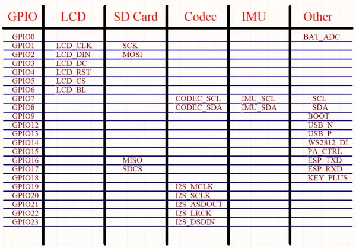

# ESP32-C6-LCD-0.85

**Waveshare** · ESP32-C6

Revision: Not identified  
Coverage: GPIO reference collected; physical pinout needed

[Browse all manufacturers](../../../../BROWSE.md) · [Desktop app](https://github.com/valleytechsolutions/black-wire-desktop)

## GPIO peripheral assignments

**GPIO reference image** · Reviewed source · WEBP

[Open original reference](../../../../library/media/c9f6f0c0b47430d3ce3f7fd693729c2fdb42bd01dda32b02a79e90daba603f7c.webp)

**Credit and rights:** Not established; source attribution retained. Source/manufacturer: Waveshare.

[Source 1](https://docs.waveshare.com/assets/images/ESP32-C6-LCD-0.85-gpio-3c5723a8dd61c1849390565db4eb149c.webp) · [Source 2](https://docs.waveshare.com/ESP32-C6-LCD-0.85)

Official reference image. This is useful for board peripherals but must not be treated as a physical header/pad pinout. Board remains in the pinout research queue.

**Partial diagram. Confirm missing pins against the exact board documentation.**

SHA-256: `c9f6f0c0b47430d3ce3f7fd693729c2fdb42bd01dda32b02a79e90daba603f7c`

Pin assignments have not been independently electrically verified. Check board revision before wiring.
