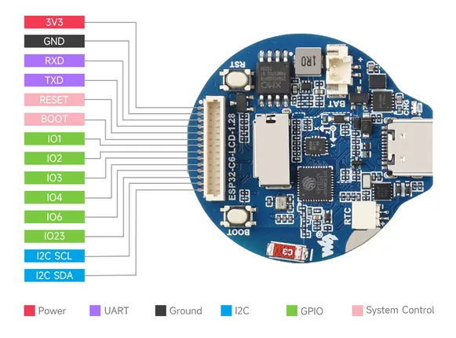

# ESP32-C6-LCD-1.28

**Waveshare** · ESP32-C6

Revision: Not identified  
Coverage: Pinout image collected

[Browse all manufacturers](../../../../BROWSE.md) · [Desktop app](https://github.com/valleytechsolutions/black-wire-desktop)

## Pinout

**pinout image** · Reviewed source · JPG

[Open original reference](../../../../library/media/9fe7792d17e045d857e0988f6898d59cfc2746cb15ff5124205dd536f947dbdd.jpg)

**Credit and rights:** Not recorded; retain original attribution. Source/manufacturer: Waveshare.

[Source 1](https://www.waveshare.com/img/devkit/ESP32-C6-LCD-1.28/ESP32-C6-LCD-1.28-details-inter.jpg) · [Source 2](https://www.waveshare.com/esp32-c6-lcd-1.28.htm)

SHA-256: `9fe7792d17e045d857e0988f6898d59cfc2746cb15ff5124205dd536f947dbdd`

## Pinout

**pinout image** · Reviewed source · WEBP

[Open original reference](../../../../library/media/feaebe94efc6071b0e7e49bee4dcaee8ddb162b3690331f7553309f9fbe07aee.webp)

**Credit and rights:** Not recorded; retain original attribution. Source/manufacturer: Waveshare.

[Source 1](https://docs.waveshare.com/assets/images/ESP32-C6-LCD-1.28-IntfIntro-6599d3e844c0230b6b7b73d41a166e1f.webp) · [Source 2](https://docs.waveshare.com/ESP32-C6-LCD-1.28)

SHA-256: `feaebe94efc6071b0e7e49bee4dcaee8ddb162b3690331f7553309f9fbe07aee`

Pin assignments have not been independently electrically verified. Check board revision before wiring.
