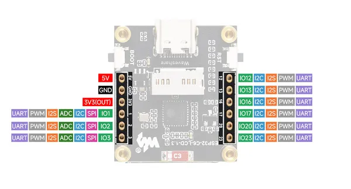
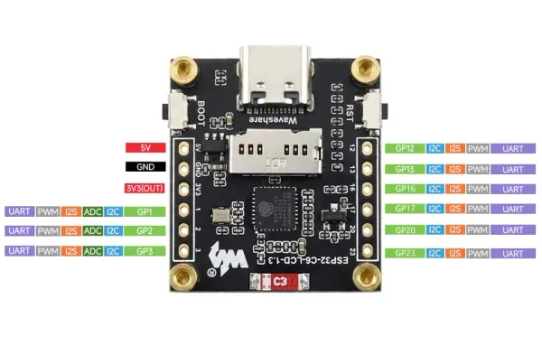

# ESP32-C6-LCD-1.3

**Waveshare** · ESP32-C6

Revision: Not identified  
Coverage: Pinout image collected

[Browse all manufacturers](../../../../BROWSE.md) · [Desktop app](https://github.com/valleytechsolutions/black-wire-desktop)

## Pinout

**pinout image** · Reviewed source · JPG

[Open original reference](../../../../library/media/81a61aaf6744a3e196d2b7954ced1be88edeacefbebf8f544143f1e37a9dbd3e.jpg)

**Credit and rights:** Not recorded; retain original attribution. Source/manufacturer: Waveshare.

[Source 1](https://www.waveshare.com/img/devkit/ESP32-C6-LCD-1.3/ESP32-C6-LCD-1.3-details-inter.jpg) · [Source 2](https://www.waveshare.com/esp32-c6-lcd-1.3.htm)

SHA-256: `81a61aaf6744a3e196d2b7954ced1be88edeacefbebf8f544143f1e37a9dbd3e`

## Pinout

**pinout image** · Reviewed source · WEBP

[Open original reference](../../../../library/media/840d6ed7bf355402a4c8ee1f140f827f83a18bd3ee006c288b2045e958ee4bea.webp)

**Credit and rights:** Not recorded; retain original attribution. Source/manufacturer: Waveshare.

[Source 1](https://docs.waveshare.com/assets/images/Interface_Definition-2fbed47abb4f7471f62bdd9d9257e681.webp) · [Source 2](https://docs.waveshare.com/ESP32-C6-LCD-1.3)

SHA-256: `840d6ed7bf355402a4c8ee1f140f827f83a18bd3ee006c288b2045e958ee4bea`

Pin assignments have not been independently electrically verified. Check board revision before wiring.
