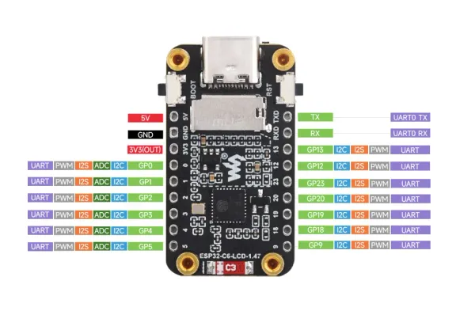

# ESP32-C6-LCD-1.47

**Waveshare** · ESP32-C6

Revision: Not identified  
Coverage: Pinout image collected

[Browse all manufacturers](../../../../BROWSE.md) · [Desktop app](https://github.com/valleytechsolutions/black-wire-desktop)

## Pinout

**pinout image** · Reviewed source · JPG

[Open original reference](../../../../library/media/d0f641945aa20805c528cadd350756a874529dba1c39e348272ab14a0244e089.jpg)

**Credit and rights:** Not recorded; retain original attribution. Source/manufacturer: Waveshare.

[Source 1](https://www.waveshare.com/img/devkit/ESP32-C6-LCD-1.47/ESP32-C6-LCD-1.47-details-9.jpg) · [Source 2](https://www.waveshare.com/esp32-c6-lcd-1.47.htm) · [Source 3](https://www.waveshare.com/wiki/ESP32-C6-LCD-1.47)

SHA-256: `d0f641945aa20805c528cadd350756a874529dba1c39e348272ab14a0244e089`

## Pinout

**pinout image** · Reviewed source · WEBP

[Open original reference](../../../../library/media/2ee57b52bf705b8cd3db8f994f3f597e969b8d5728f80d5fdb140502e91da5ae.webp)

**Credit and rights:** Not recorded; retain original attribution. Source/manufacturer: Waveshare.

[Source 1](https://docs.waveshare.com/assets/images/ESP32-C6-LCD-1.47-4-e0c537b216e775b3dd53555a9bc5aada.webp) · [Source 2](https://docs.waveshare.com/ESP32-C6-LCD-1.47)

SHA-256: `2ee57b52bf705b8cd3db8f994f3f597e969b8d5728f80d5fdb140502e91da5ae`

Pin assignments have not been independently electrically verified. Check board revision before wiring.
