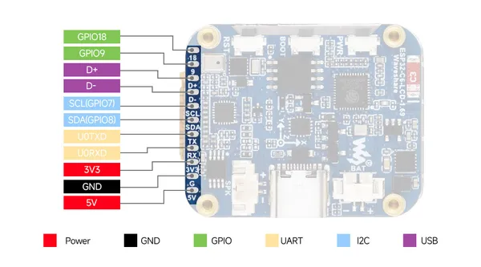
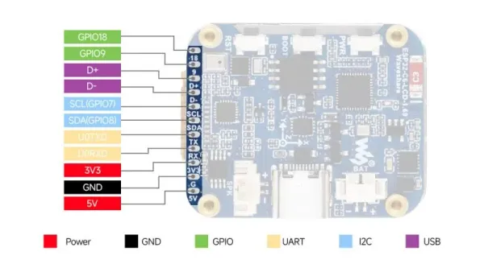

# ESP32-C6-LCD-1.69

**Waveshare** · ESP32-C6

Revision: Not identified  
Coverage: Pinout image collected

[Browse all manufacturers](../../../../BROWSE.md) · [Desktop app](https://github.com/valleytechsolutions/black-wire-desktop)

## Pinout

**pinout image** · Reviewed source · JPG

[Open original reference](../../../../library/media/726313511d80d770484f988fdb872f1928b7f9cc8414bb7e647323bf0851739f.jpg)

**Credit and rights:** Not recorded; retain original attribution. Source/manufacturer: Waveshare.

[Source 1](https://www.waveshare.com/img/devkit/ESP32-C6-LCD-1.69/ESP32-C6-LCD-1.69-inter.jpg) · [Source 2](https://www.waveshare.com/esp32-c6-lcd-1.69.htm)

SHA-256: `726313511d80d770484f988fdb872f1928b7f9cc8414bb7e647323bf0851739f`

## Pinout

**pinout image** · Reviewed source · JPG

[Open original reference](../../../../library/media/2ab2a6896bd19bb131d483ee13f496daddb98dfa1f74c302035c3c9950159cc7.jpg)

**Credit and rights:** Not recorded; retain original attribution. Source/manufacturer: Waveshare.

[Source 1](https://www.waveshare.com/w/upload/c/c8/ESP32-C6-LCD-1.69-inter.jpg) · [Source 2](https://www.waveshare.com/wiki/ESP32-C6-LCD-1.69)

SHA-256: `2ab2a6896bd19bb131d483ee13f496daddb98dfa1f74c302035c3c9950159cc7`

## Pinout

**pinout image** · Reviewed source · WEBP

[Open original reference](../../../../library/media/b127eb75a92e4853d8ea758e262919b52faf1df1d54fd5be35466ce87b105a13.webp)

**Credit and rights:** Not recorded; retain original attribution. Source/manufacturer: Waveshare.

[Source 1](https://docs.waveshare.com/assets/images/ESP32-C6-LCD-1.69-inter-980553341bf7a7d8848bc3d5bedeb54c.webp) · [Source 2](https://docs.waveshare.com/ESP32-C6-LCD-1.69)

SHA-256: `b127eb75a92e4853d8ea758e262919b52faf1df1d54fd5be35466ce87b105a13`

Pin assignments have not been independently electrically verified. Check board revision before wiring.
