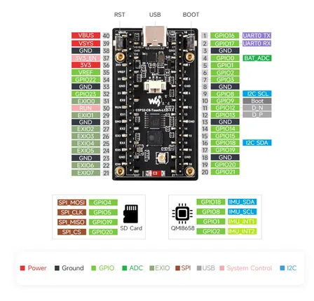

# ESP32-C6-LCD-1.9

**Waveshare** · ESP32-C6

Revision: Not identified  
Coverage: Pinout image collected

[Browse all manufacturers](../../../../BROWSE.md) · [Desktop app](https://github.com/valleytechsolutions/black-wire-desktop)

## Pinout

**pinout image** · Reviewed source · JPG

[Open original reference](../../../../library/media/dd3307c8dc5f7ba2c07c8630f25c1b55c0f64c7d10002a853e007979e157662d.jpg)

**Credit and rights:** Not recorded; retain original attribution. Source/manufacturer: Waveshare.

[Source 1](https://www.waveshare.com/img/devkit/ESP32-C6-LCD-1.9/ESP32-C6-LCD-1.9-details-inter.jpg) · [Source 2](https://www.waveshare.com/esp32-c6-lcd-1.9.htm)

SHA-256: `dd3307c8dc5f7ba2c07c8630f25c1b55c0f64c7d10002a853e007979e157662d`

Pin assignments have not been independently electrically verified. Check board revision before wiring.
