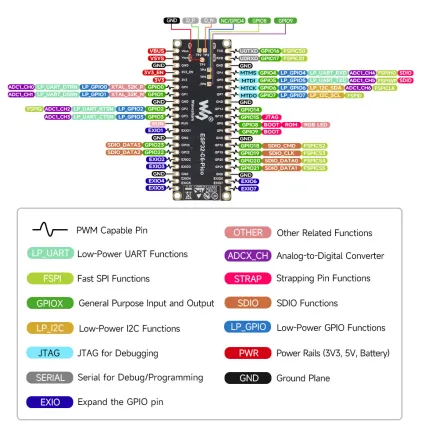

# ESP32-C6-Pico

**Waveshare** · ESP32-C6

Revision: Not identified  
Coverage: Pinout image collected

[Browse all manufacturers](../../../../BROWSE.md) · [Desktop app](https://github.com/valleytechsolutions/black-wire-desktop)

## Pinout

**pinout image** · Reviewed source · WEBP

[Open original reference](../../../../library/media/642102af8c63d182d6bd983e360f04e713e0fb1b23cd200da78f13303a1b3d58.webp)

**Credit and rights:** Not recorded; retain original attribution. Source/manufacturer: Waveshare.

[Source 1](https://docs.waveshare.com/assets/images/ESP32-C6-Pico_Pin_Configuration-8754f569f0149029a828342be3608792.webp) · [Source 2](https://docs.waveshare.com/ESP32-C6-Pico)

SHA-256: `642102af8c63d182d6bd983e360f04e713e0fb1b23cd200da78f13303a1b3d58`

## Pinout

**pinout image** · Reviewed source · JPG

[Open original reference](../../../../library/media/3ba3ed2dcb855cd3a7a453a49c3d48acd5c649072685d678865fdff6b44b1917.jpg)

**Credit and rights:** Not recorded; retain original attribution. Source/manufacturer: Waveshare.

[Source 1](https://www.waveshare.com/w/upload/e/ef/ESP32-C6-Pico-Pinout2.jpg) · [Source 2](https://www.waveshare.com/wiki/ESP32-C6-Pico) · [Source 3](https://www.waveshare.com/esp32-c6-pico.htm)

SHA-256: `3ba3ed2dcb855cd3a7a453a49c3d48acd5c649072685d678865fdff6b44b1917`

Pin assignments have not been independently electrically verified. Check board revision before wiring.
