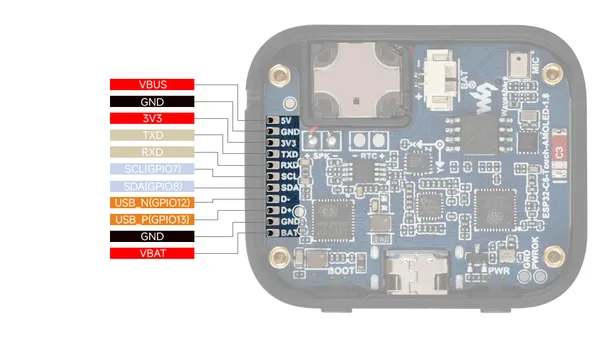
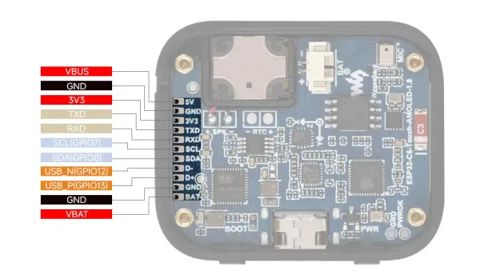

# ESP32-C6-Touch-AMOLED-1.8

**Waveshare** · ESP32-C6

Revision: Not identified  
Coverage: Pinout image collected

[Browse all manufacturers](../../../../BROWSE.md) · [Desktop app](https://github.com/valleytechsolutions/black-wire-desktop)

## Pinout

**pinout image** · Reviewed source · JPG

[Open original reference](../../../../library/media/85897dd9ed1c18f1595593d65634941a8bd183e2bed0ad933c2dc440658dc4b8.jpg)

**Credit and rights:** Not recorded; retain original attribution. Source/manufacturer: Waveshare.

[Source 1](https://www.waveshare.com/img/devkit/ESP32-C6-Touch-AMOLED-1.8/ESP32-C6-Touch-AMOLED-1.8-details-inter.jpg) · [Source 2](https://www.waveshare.com/esp32-c6-touch-amoled-1.8.htm)

SHA-256: `85897dd9ed1c18f1595593d65634941a8bd183e2bed0ad933c2dc440658dc4b8`

## Pinout

**pinout image** · Reviewed source · WEBP

[Open original reference](../../../../library/media/72a2cdbc5cce2c7a572c7e11056b3cfd4334b7a1e7ecb0172a9e1599f3f2ff11.webp)

**Credit and rights:** Not recorded; retain original attribution. Source/manufacturer: Waveshare.

[Source 1](https://docs.waveshare.com/assets/images/ESP32-C6-Touch-AMOLED-1.8-IntfIntro-09d4419d0cc74a4bd3cc025cd986e787.webp) · [Source 2](https://docs.waveshare.com/ESP32-C6-Touch-AMOLED-1.8)

SHA-256: `72a2cdbc5cce2c7a572c7e11056b3cfd4334b7a1e7ecb0172a9e1599f3f2ff11`

Pin assignments have not been independently electrically verified. Check board revision before wiring.
