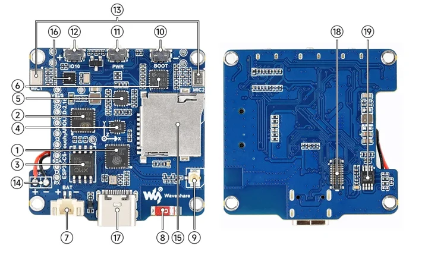
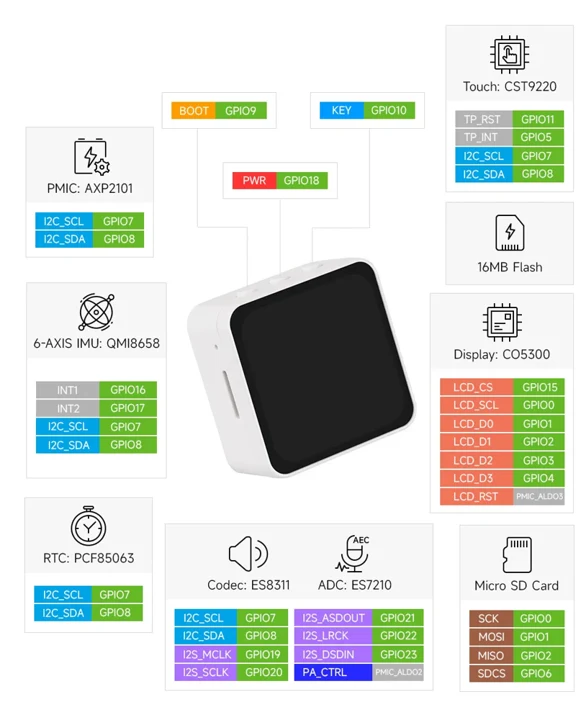
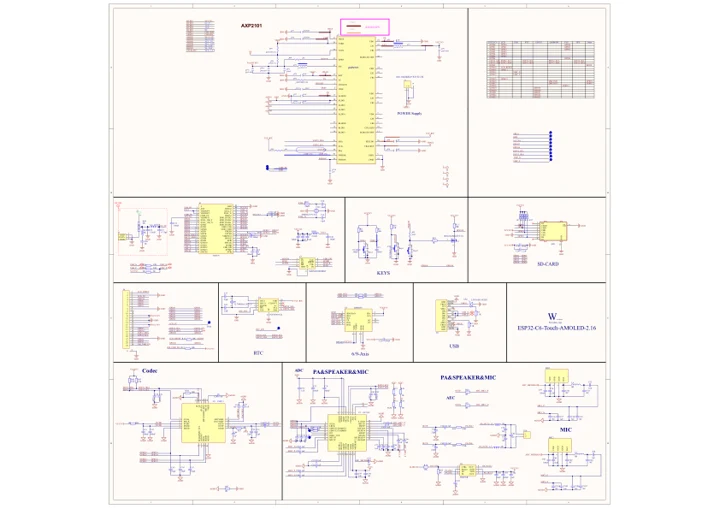

# ESP32-C6-Touch-AMOLED-2.16

**Waveshare** · ESP32-C6

Revision: Not identified

Coverage: Manufacturer references reviewed by scope; independent electrical and all-connector review pending

[Browse all manufacturers](../../../../BROWSE.md) · [Devices & IoT](../../../../DEVICES.md) · [Open in the browser guide](https://valleytech-black-wire-guide.pages.dev/?board=waveshare-esp32-esp32-c6-touch-amoled-2-16)

## Datasheets and original documentation

Board datasheet: **not yet recorded**. Visual reference: **available**.

[Manufacturer hardware documentation](https://docs.waveshare.com/ESP32-C6-Touch-AMOLED-2.16)

- **schematic / board**: [ESP32-C6-Touch-AMOLED-2.16 Schematic Diagram](https://files.waveshare.com/wiki/ESP32-C6-Touch-AMOLED-2.16/ESP32-C6-Touch-AMOLED-2.16-Schematic.pdf) · [saved document](../../../../library/media/6918d8e87cbf6b5bd7193957571992958f08e6a0621a5a5d78cec6049b88bd22.pdf)
- **hardware-guide / board**: [Manufacturer pin and hardware documentation](https://docs.waveshare.com/ESP32-C6-Touch-AMOLED-2.16) · online

A chip datasheet, schematic and board datasheet have different scopes. Match the exact hardware revision.

[Documentation coverage and remaining gaps](../../../../DOCUMENTATION.md)

## Onboard Resources ​

**board labeling image** · Source identity and visual scope inspected; PDF review covers first-page preview. Independent electrical and all-connector completeness review pending. · WEBP

[Open original reference](../../../../library/media/24e945aa60b3157c1f3ad9df7ee8688dc820f3b9b6f9dfa3063319a74ed91a85.webp)

**Credit and rights:** Manufacturer artwork; reuse and print rights not established. Inclusion does not relicense the original.. Source/manufacturer: Waveshare.

[Source 1](https://docs.waveshare.com/assets/images/ESP32-C6-Touch-AMOLED-2.16-HW-444fe961eec158f8546e5a3df9e4863a.webp) · [Source 2](https://docs.waveshare.com/ESP32-C6-Touch-AMOLED-2.16)

Manufacturer source retained unchanged. Source identity and visual scope inspected; PDF review covers first-page preview. Independent electrical and all-connector completeness review pending. See the linked manufacturer page for the numbered component legend. This is not a complete physical pinout.

Image revision: As supplied in the original; match exact board revision

SHA-256: `24e945aa60b3157c1f3ad9df7ee8688dc820f3b9b6f9dfa3063319a74ed91a85`

## Interface Introduction ​

**pin function reference** · Source identity and visual scope inspected; PDF review covers first-page preview. Independent electrical and all-connector completeness review pending. · WEBP

[Open original reference](../../../../library/media/d040001675d0083014a31f1f88c894427ca7a4466b9ed9efcdfcc7b12927b665.webp)

**Credit and rights:** Manufacturer artwork; reuse and print rights not established. Inclusion does not relicense the original.. Source/manufacturer: Waveshare.

[Source 1](https://docs.waveshare.com/assets/images/ESP32-C6-Touch-AMOLED-2.16-IntfIntro-6aa336a195c225bc3645e3909339f20f.webp) · [Source 2](https://docs.waveshare.com/ESP32-C6-Touch-AMOLED-2.16)

Manufacturer source retained unchanged. Source identity and visual scope inspected; PDF review covers first-page preview. Independent electrical and all-connector completeness review pending.

Image revision: As supplied in the original; match exact board revision

SHA-256: `d040001675d0083014a31f1f88c894427ca7a4466b9ed9efcdfcc7b12927b665`

## ESP32-C6-Touch-AMOLED-2.16 Schematic Diagram

**original reference PDF** · Source identity and visual scope inspected; PDF review covers first-page preview. Independent electrical and all-connector completeness review pending. · PDF

[Open original reference](../../../../library/media/6918d8e87cbf6b5bd7193957571992958f08e6a0621a5a5d78cec6049b88bd22.pdf)

**Credit and rights:** Manufacturer artwork; reuse and print rights not established. Inclusion does not relicense the original.. Source/manufacturer: Waveshare.

[Source 1](https://files.waveshare.com/wiki/ESP32-C6-Touch-AMOLED-2.16/ESP32-C6-Touch-AMOLED-2.16-Schematic.pdf) · [Source 2](https://docs.waveshare.com/ESP32-C6-Touch-AMOLED-2.16/Resources-And-Documents)

Manufacturer source retained unchanged. Source identity and visual scope inspected; PDF review covers first-page preview. Independent electrical and all-connector completeness review pending.

Image revision: As supplied in the original; match exact board revision

SHA-256: `6918d8e87cbf6b5bd7193957571992958f08e6a0621a5a5d78cec6049b88bd22`

Pin assignments have not been independently electrically verified. Check board revision before wiring.
