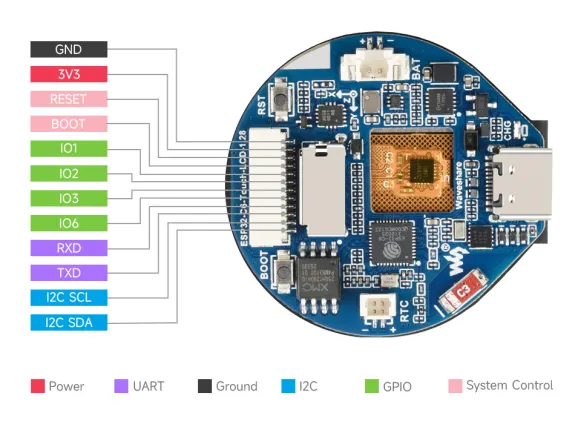

# ESP32-C6-Touch-LCD-1.28

**Waveshare** · ESP32-C6

Revision: Not identified  
Coverage: Pinout image collected

[Browse all manufacturers](../../../../BROWSE.md) · [Desktop app](https://github.com/valleytechsolutions/black-wire-desktop)

## Pinout

**pinout image** · Reviewed source · JPG

[Open original reference](../../../../library/media/6aa1b498f94cfb05152ffb312d6ce83e2a7d60c9a3127370c8fe5d447e5fa646.jpg)

**Credit and rights:** Not recorded; retain original attribution. Source/manufacturer: Waveshare.

[Source 1](https://www.waveshare.com/img/devkit/ESP32-C6-Touch-LCD-1.28/ESP32-C6-Touch-LCD-1.28-details-inter.jpg) · [Source 2](https://www.waveshare.com/esp32-c6-touch-lcd-1.28.htm)

SHA-256: `6aa1b498f94cfb05152ffb312d6ce83e2a7d60c9a3127370c8fe5d447e5fa646`

## Pinout

**pinout image** · Reviewed source · WEBP

[Open original reference](../../../../library/media/1851ce33a457a6376bf2327f4662fef52305e09f825181f34cd70e47c77b788e.webp)

**Credit and rights:** Not recorded; retain original attribution. Source/manufacturer: Waveshare.

[Source 1](https://docs.waveshare.com/assets/images/ESP32-C6-Touch-LCD-1.28-IntfIntro-24a01cc7e9d98e0f0748362c64ea01cf.webp) · [Source 2](https://docs.waveshare.com/ESP32-C6-Touch-LCD-1.28)

SHA-256: `1851ce33a457a6376bf2327f4662fef52305e09f825181f34cd70e47c77b788e`

Pin assignments have not been independently electrically verified. Check board revision before wiring.
