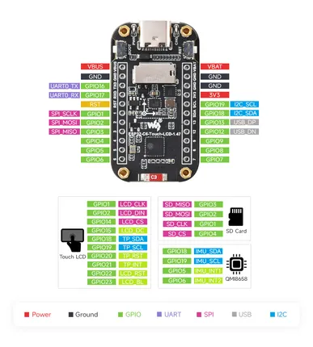

# ESP32-C6-Touch-LCD-1.47

**Waveshare** · ESP32-C6

Revision: Not identified  
Coverage: Pinout image collected

[Browse all manufacturers](../../../../BROWSE.md) · [Desktop app](https://github.com/valleytechsolutions/black-wire-desktop)

## Pinout

**pinout image** · Reviewed source · JPG

[Open original reference](../../../../library/media/0c75f3489bd60d240dbe1bd37de9fa6866023a206404ccac359890cd392d83e1.jpg)

**Credit and rights:** Not recorded; retain original attribution. Source/manufacturer: Waveshare.

[Source 1](https://www.waveshare.com/img/devkit/ESP32-C6-Touch-LCD-1.47/ESP32-C6-Touch-LCD-1.47-details-inter.jpg) · [Source 2](https://www.waveshare.com/esp32-c6-touch-lcd-1.47.htm)

SHA-256: `0c75f3489bd60d240dbe1bd37de9fa6866023a206404ccac359890cd392d83e1`

## Pinout

**pinout image** · Reviewed source · WEBP

[Open original reference](../../../../library/media/a0b584e7221aeae6c85f0fa23d0367059e8c5443e50b1b5e8979c2a9bd20a704.webp)

**Credit and rights:** Not recorded; retain original attribution. Source/manufacturer: Waveshare.

[Source 1](https://docs.waveshare.com/assets/images/ESP32-C6-Touch-LCD-1.47-details-inter-27f8f0c6d70114f21e2fee2ea079c0c7.webp) · [Source 2](https://docs.waveshare.com/ESP32-C6-Touch-LCD-1.47)

SHA-256: `a0b584e7221aeae6c85f0fa23d0367059e8c5443e50b1b5e8979c2a9bd20a704`

## Pinout

**pinout image** · Reviewed source · JPG

[Open original reference](../../../../library/media/271b6b53a5a9b589feb5ebdc8e707220dd2ee787932a0fccb499dbf5df85842f.jpg)

**Credit and rights:** Not recorded; retain original attribution. Source/manufacturer: Waveshare.

[Source 1](https://www.waveshare.com/w/upload/7/71/ESP32-C6-Touch-LCD-1.47-details-inter.jpg) · [Source 2](https://www.waveshare.com/wiki/ESP32-C6-Touch-LCD-1.47)

SHA-256: `271b6b53a5a9b589feb5ebdc8e707220dd2ee787932a0fccb499dbf5df85842f`

Pin assignments have not been independently electrically verified. Check board revision before wiring.
